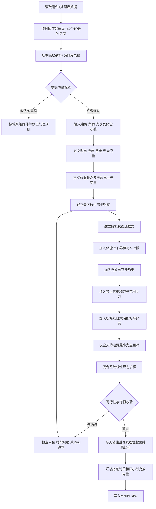

第一问最适合采用“含充放电互斥、弃光变量、储能效率和终端电量约束的改进混合整数线性规划模型”。该模型把一天划分为 144 个 10 分钟时段，在保证负荷全部满足、储能安全运行且日初日末电量相等的前提下，使全天购电费用最小。

以下内容可直接作为论文“问题一模型建立”章节的主体。题目条件来自 :codex-file-citation{path="D:\codex project\数学建模\C题.pdf" purpose="source"}，数值依据为[附件1处理后数据](</D:/codex project/数学建模/working/prepared_data/附件1处理后.json>)及[数据预处理结果](</D:/codex project/数学建模/outputs/01a08ae9-b1f2-7cb1-8533-3abdadca9c5b/数据预处理结果.xlsx>)。

# 一、问题重述与模型选择

已知某日每隔 10 分钟的：

- 外部电网购电价格；
- 小区负荷功率；
- 光伏预测功率；
- 储能容量、充放电功率、效率和初始电量。

需要决定每个时段：

- 从外部电网购买多少电；
- 储能充入多少电；
- 储能释放多少电；
- 无法消纳的光伏电量；
- 每个时段结束后的储能电量。

同时满足：

1. 小区负荷在每个时段均被完全满足；
2. 储能电量始终处于安全范围1200-10800；
3. 充放电功率不超过额定功率；
4. 同一时段不能同时充电和放电；?????????
5. 0:00 与 24:00 储能电量相等；
6. 全天购电费用最小。

除充放电状态互斥需要二元变量外，目标函数和其余约束均为线性关系，因此构成混合整数线性规划模型。与普通线性规划相比，它能够严格排除同一时段同时充放电的非物理解。

---

# 二、模型准备

## 2.1 时间离散化

设一天的时段集合为

\[
\mathcal T=\{1,2,\ldots,144\},
\]

每个时段长度为

\[
\Delta t=\frac{10}{60}=\frac16\ {\rm h}.
\tag{1}
\]

附件中负荷与光伏数据的单位是千瓦，输出要求的购电量、充放电量单位是千瓦时，因此必须先将功率转换为时段电量：

\[
L_t=P^{L}_t\Delta t=\frac{P^{L}_t}{6},
\qquad
R_t=P^{PV}_t\Delta t=\frac{P^{PV}_t}{6}.
\tag{2}
\]

式（2）中：

- \(P^L_t\) 表示第 \(t\) 时段平均负荷功率；
- \(P^{PV}_t\) 表示第 \(t\) 时段平均光伏预测功率；
- \(L_t\) 表示该时段负荷电量；
- \(R_t\) 表示该时段可用光伏电量。

这个转换非常关键。如果直接将千瓦功率代入以千瓦时表示的储能状态方程，会导致量纲错误并将电量放大 6 倍。

## 2.2 数据质量与使用原则

处理后的附件 1 包含 144 条记录，检查结果为：

| 检查项目           |                 结果 |
| ------------------ | -------------------: |
| 总时段数           |                  144 |
| 数值型缺失记录     |                    0 |
| 四分位距候选异常   |                    0 |
| 负功率或负电价记录 |                    0 |
| 时段粒度           |              10 分钟 |
| 优化是否标准化     | 否，保留原始物理单位 |

由于附件 1 没有缺失值和候选异常值，第一问不需要插值、删除或缩尾处理。标准分数仅适合后续预测模型，不能用于储能调度约束；否则储能容量、功率和电量将失去物理意义。

## 2.3 处理后数据的建模诊断

| 指标                   |                     数值 |
| ---------------------- | -----------------------: |
| 全天负荷电量           |   \(111024.8081\) 千瓦时 |
| 全天光伏预测电量       |    \(55482.8357\) 千瓦时 |
| 全天负荷减光伏的代数和 |    \(55541.9724\) 千瓦时 |
| 最大正净负荷           | \(826.0833\) 千瓦时/时段 |
| 最大光伏富余           | \(352.9209\) 千瓦时/时段 |
| 光伏富余时段数         |                       30 |
| 光伏富余总量           |     \(6247.9630\) 千瓦时 |
| 最低电价               |     \(0.3713\) 元/千瓦时 |
| 最高电价               |     \(1.3952\) 元/千瓦时 |
| 无储能购电量基准       |    \(61789.9354\) 千瓦时 |
| 无储能购电费基准       |        \(48052.0466\) 元 |

其中，无储能基准按下式计算：

\[
G^{(0)}_t=\max\{L_t-R_t,0\}.
\tag{3}
\]

对应弃光量为

\[
W^{(0)}_t=\max\{R_t-L_t,0\}.
\tag{4}
\]

无储能基准只用于比较，不是第一问的最终答案。优化后的购电费用原则上不应高于该基准；否则通常说明模型、效率口径、时段映射或求解过程存在问题。

---

# 三、参数定义

| 参数                | 含义                 |      单位 |          数值或范围 |
| ------------------- | -------------------- | --------: | ------------------: |
| \(t\)               | 10 分钟时段序号      |        — |    \(1,\ldots,144\) |
| \(\Delta t\)        | 单个时段长度         |      小时 |             \(1/6\) |
| \(p_t\)             | 第\(t\) 时段购电价格 | 元/千瓦时 |            数据给定 |
| \(P^L_t\)           | 小区负荷功率         |      千瓦 |            数据给定 |
| \(P^{PV}_t\)        | 光伏预测功率         |      千瓦 |            数据给定 |
| \(L_t\)             | 时段负荷电量         |    千瓦时 |         \(P^L_t/6\) |
| \(R_t\)             | 时段可用光伏电量     |    千瓦时 |      \(P^{PV}_t/6\) |
| \(E^{\max}\)        | 储能额定容量         |    千瓦时 |               12000 |
| \(E^{\min}\)        | 储能安全下限         |    千瓦时 |                1200 |
| \(E^{\mathrm{up}}\) | 储能安全上限         |    千瓦时 |               10800 |
| \(E^0\)             | 0:00 初始储能电量    |    千瓦时 |                6000 |
| \(P^{ch,\max}\)     | 最大充电功率         |      千瓦 |                5000 |
| \(P^{dis,\max}\)    | 最大放电功率         |      千瓦 |                5000 |
| \(\bar q^{ch}\)     | 每时段最大充电量     |    千瓦时 | \(5000/6=833.3333\) |
| \(\bar q^{dis}\)    | 每时段最大放电量     |    千瓦时 | \(5000/6=833.3333\) |
| \(\eta_{ch}\)       | 充电效率             |        — |                0.90 |
| \(\eta_{dis}\)      | 放电效率             |        — |                0.90 |

若将题目中的“充放电效率为 90%”解释为充电和放电各自效率均为 90%，则往返效率为

\[
\eta_{\mathrm{rt}}=\eta_{ch}\eta_{dis}=0.9^2=0.81.
\tag{5}
\]

如果官方说明将 90% 定义为总往返效率，则应改为

\[
\eta_{ch}=\eta_{dis}=\sqrt{0.9}\approx0.948683.
\tag{6}
\]

建议正文以式（5）为主方案，并以式（6）作为效率口径敏感性分析。

---

# 四、变量定义

## 4.1 决策变量、中间变量和目标变量

| 类别     | 符号                  | 含义                         | 类型 | 单位   | 取值范围                        |
| -------- | --------------------- | ---------------------------- | ---- | ------ | ------------------------------- |
| 决策变量 | \(g_t\)               | 第\(t\) 时段外部电网购电量   | 连续 | 千瓦时 | \(0\le g_t\le L_t+\bar q^{ch}\) |
| 决策变量 | \(c_t\)               | 第\(t\) 时段储能交流侧充电量 | 连续 | 千瓦时 | \(0\le c_t\le833.3333\)         |
| 决策变量 | \(d_t\)               | 第\(t\) 时段储能交流侧放电量 | 连续 | 千瓦时 | \(0\le d_t\le833.3333\)         |
| 决策变量 | \(w_t\)               | 第\(t\) 时段弃光量           | 连续 | 千瓦时 | \(0\le w_t\le R_t\)             |
| 决策变量 | \(u^{ch}_t\)          | 第\(t\) 时段是否允许充电     | 二元 | —     | \(\{0,1\}\)                     |
| 决策变量 | \(u^{dis}_t\)         | 第\(t\) 时段是否允许放电     | 二元 | —     | \(\{0,1\}\)                     |
| 中间变量 | \(E_t\)               | 第\(t\) 时段结束时的储能电量 | 连续 | 千瓦时 | \([1200,10800]\)                |
| 中间变量 | \(N_t\)               | 未考虑储能时的净负荷         | 连续 | 千瓦时 | \(N_t=L_t-R_t\)                 |
| 中间变量 | \(Q\)                 | 全天储能吞吐量               | 连续 | 千瓦时 | \(Q=\sum_t(c_t+d_t)\)           |
| 目标变量 | \(C_{\mathrm{grid}}\) | 全天外部电网购电费用         | 连续 | 元     | \(C_{\mathrm{grid}}\ge0\)       |

这里将 \(c_t\) 定义为储能交流侧吸收的电量，将 \(d_t\) 定义为储能交流侧送回微网的电量。因此：

- 充电后真正进入电池的电量为 \(\eta_{ch}c_t\)；
- 为向微网释放 \(d_t\)，电池内部需要减少 \(d_t/\eta_{dis}\)。

这种定义可以避免在供需平衡式中重复计算效率。

---

# 五、模型假设及合理性

| 假设   | 具体内容                                                                 | 合理性说明                                                                             |
| ------ | ------------------------------------------------------------------------ | -------------------------------------------------------------------------------------- |
| 假设一 | 第一问中当天电价、负荷功率和光伏预测功率在 0:00 均已知，并作为确定性参数 | 第一问要求依据附件 1 制订单日计划，重点是建立基础调度模型，不要求研究预测误差          |
| 假设二 | 每个 10 分钟时段内负荷、光伏功率和电价保持为给定平均值                   | 原始数据粒度为 10 分钟，采用分段常数假设可将功率准确转换为时段电量                     |
| 假设三 | 允许弃光，但不允许向外部电网售电                                         | 题目未给出售电价格或上网结算规则；增加弃光变量可以保证光伏富余且储能已满时模型仍然可行 |
| 假设四 | 外部电网可提供足够购电功率，不设置额外购电功率上限                       | 题目未给出外部电网容量限制；若后续取得上限，只需增加\(g_t\le\bar g_t\)                 |
| 假设五 | 除储能充放电效率外，忽略线路损耗、自放电、温度变化和短期容量衰减         | 单日调度时间较短，题目未提供这些参数；循环损耗只作为次级规则或敏感性因素处理           |

负荷不能被削减不是简化假设，而是题目的强制要求，因此模型中不设置“未满足负荷”变量。

此外，混合整数优化不要求负荷、电价、光伏等参数在统计意义上相互独立。这里真正需要检查的是：

- 时段序号是否唯一；
- 三类数据是否按同一时段对齐；
- 功率和电量单位是否一致；
- 约束是否可行；
- 不应把“相关性检验”误当作优化建模的必要条件。

---

# 六、核心公式的分步推导

## 6.1 净负荷

定义不考虑储能时的净负荷：

\[
N_t=L_t-R_t.
\tag{7}
\]

其物理含义为：

- \(N_t>0\)：光伏不足，需要电网购电或储能放电；
- \(N_t<0\)：光伏富余，可以给储能充电或弃光。

处理后数据中共有 30 个光伏富余时段，富余总量约为 \(6247.9630\) 千瓦时，因此弃光变量和储能吸收机制是必要的。

## 6.2 微网电量平衡

第 \(t\) 时段进入母线的电量包括：

- 电网购电 \(g_t\)；
- 可用光伏 \(R_t\)；
- 储能放电 \(d_t\)。

流出母线的电量包括：

- 小区负荷 \(L_t\)；
- 储能充电 \(c_t\)；
- 弃光 \(w_t\)。

因此得到

\[
g_t+R_t+d_t=L_t+c_t+w_t,
\qquad t\in\mathcal T.
\tag{8}
\]

式（8）是模型最核心的供需平衡约束。

等价地，可以写为

\[
g_t+d_t-(c_t+w_t)=N_t.
\tag{9}
\]

式（9）表明，电网购电和储能放电共同弥补正净负荷，而储能充电与弃光共同消纳负净负荷。

## 6.3 储能状态递推

充电存在能量损耗，放电时也存在损耗，因此储能状态递推式为

\[
E_t
===

E_{t-1}
+\eta_{ch}c_t
-\frac{d_t}{\eta_{dis}},
\qquad t=1,\ldots,144.
\tag{10}
\]

式（10）的物理含义是：

- 交流侧输入 \(c_t\) 千瓦时，只有 \(\eta_{ch}c_t\) 进入电池；
- 交流侧输出 \(d_t\) 千瓦时，需要从电池中提取 \(d_t/\eta_{dis}\) 千瓦时。

例如，当 \(\eta_{ch}=\eta_{dis}=0.9\) 时，交流侧充入 100 千瓦时，电池只增加 90 千瓦时；若交流侧再输出 81 千瓦时，电池恰好减少 90 千瓦时。

## 6.4 储能容量约束

为防止过充和过放，任意时段均应满足

\[
1200\le E_t\le10800,
\qquad t=1,\ldots,144.
\tag{11}
\]

虽然储能额定容量为 12000 千瓦时，但题目规定安全运行区间为 1200～10800 千瓦时，因此实际可调节储能区间为

\[
10800-1200=9600\ {\rm kWh}.
\tag{12}
\]

初始电量为 6000 千瓦时，向上和向下的储能空间均为 4800 千瓦时。

## 6.5 充放电功率约束

最大充放电功率均为 5000 千瓦。转换为 10 分钟电量上限：

\[
\bar q^
=======

\bar q^
=======

5000\times\frac16
=================

833.3333\ {\rm kWh}.
\tag{13}
\]

于是

\[
0\le c_t\le \bar q^{ch}u^{ch}_t,
\tag{14}
\]

\[
0\le d_t\le \bar q^{dis}u^{dis}_t.
\tag{15}
\]

式（14）和式（15）同时表达充放电功率上限及运行状态。

## 6.6 充放电互斥约束

同一时段储能不能同时充电和放电：

\[
u^{ch}_t+u^{dis}_t\le1,
\tag{16}
\]

\[
u^{ch}_t,u^{dis}_t\in\{0,1\}.
\tag{17}
\]

三种运行状态分别为：

| \(u^{ch}_t\) | \(u^{dis}_t\) | 状态           |
| -----------: | ------------: | -------------- |
|            1 |             0 | 允许充电       |
|            0 |             1 | 允许放电       |
|            0 |             0 | 空闲           |
|            1 |             1 | 被式（16）禁止 |

虽然在电价为正、效率小于 1 的情况下，同时充放电通常不会改善购电费用，但二元互斥约束能够严格排除数值退化或多重最优解中的非物理解。

## 6.7 弃光与禁止售电约束

\[
0\le w_t\le R_t.
\tag{18}
\]

其中 \(w_t=0\) 表示全部光伏得到利用，\(w_t>0\) 表示部分光伏因负荷、储能容量或充电功率限制而无法消纳。

同时规定

\[
g_t\ge0.
\tag{19}
\]

模型中不设置负购电量或售电变量，因此不会把剩余光伏反向出售给电网。

由式（8）还可以得到一个不改变可行域的紧上界：

\[
g_t\le L_t+\bar q^{ch}.
\tag{20}
\]

该上界可以缩小求解范围、提高计算效率。

## 6.8 初始和终端储能约束

题目给出初始储能为 6000 千瓦时：

\[
E_0=6000.
\tag{21}
\]

同时要求 0:00 和 24:00 储能相等：

\[
E_{144}=E_0=6000.
\tag{22}
\]

式（22）十分重要。若不设置终端约束，模型会倾向于在最后几个高价时段耗尽储能，从而人为降低当天成本，但这种方案会把成本转移到下一天，不具有可持续性。

---

# 七、目标函数

## 7.1 题目要求的主目标

全天购电费用为

\[
C_}
===

\sum_{t=1}^{144}p_tg_t.
\tag{23}
\]

第一层目标为

\[
\min C_{\mathrm{grid}}.
\tag{24}
\]

式（24）严格对应题目“尽可能节省微网购电费用”的要求。

## 7.2 小额循环成本的严谨处理

由于题目没有给出电池折旧成本，不宜随意添加一个较大的循环费用并改变原问题。因此推荐采用两层优化：

第一层：

\[
C^*=\min\sum_{t=1}^{144}p_tg_t.
\tag{25}
\]

第二层在保持购电费最优的条件下，最小化储能吞吐量：

\[
\min Q=\sum_{t=1}^{144}(c_t+d_t),
\tag{26}
\]

满足

\[
\sum_{t=1}^{144}p_tg_t\le C^*+\varepsilon_{\mathrm{tol}}.
\tag{27}
\]

其中 \(\varepsilon_{\mathrm{tol}}\) 是很小的求解容差。这样可以：

- 保证题目要求的购电费仍是第一优先级；
- 在多个购电费相同的方案中选择充放电次数更少的方案；
- 减少无效循环；
- 避免把人为设定的折旧参数冒充题目已知参数。

如果取得可靠的电池循环寿命和折旧数据，则可将目标扩展为

\[
\min C_}
========

\sum_{t=1}^{144}p_tg_t
+
\kappa\sum_{t=1}^{144}(c_t+d_t),
\tag{28}
\]

其中 \(\kappa\) 为单位储能吞吐量的等效循环成本。

---

# 八、完整模型

综上，第一问的主模型可以写成：

\[
\boxed{
\begin{aligned}
\min\quad
&\sum_{t=1}^{144}p_tg_t\\
\text{满足}\quad
&g_t+R_t+d_t=L_t+c_t+w_t,
&&\forall t,\\
&E_t=E_{t-1}+\eta_{ch}c_t-\frac{d_t}{\eta_{dis}},
&&\forall t,\\
&1200\le E_t\le10800,
&&\forall t,\\
&0\le c_t\le833.3333u^{ch}_t,
&&\forall t,\\
&0\le d_t\le833.3333u^{dis}_t,
&&\forall t,\\
&u^{ch}_t+u^{dis}_t\le1,
&&\forall t,\\
&0\le w_t\le R_t,
&&\forall t,\\
&0\le g_t\le L_t+833.3333,
&&\forall t,\\
&E_0=6000,\quad E_{144}=6000,\\
&u^{ch}_t,u^{dis}_t\in\{0,1\}.
\end{aligned}}
\tag{29}
\]

模型共有：

- 144 个购电量变量；
- 144 个充电量变量；
- 144 个放电量变量；
- 144 个弃光量变量；
- 144 个期末储能状态变量；
- 288 个充放电状态二元变量。

变量规模较小，标准混合整数线性规划求解器可以快速获得全局最优解。

---

# 九、模型机理解释

## 9.1 储能套利条件

假设在低价时段 \(i\) 从电网多购买 \(c_i\) 千瓦时用于充电，之后在高价时段 \(j\) 放电。最终可向负荷提供的电量为

\[
d_j=\eta_{ch}\eta_{dis}c_i.
\tag{30}
\]

不考虑循环成本时，储能套利有利的条件为

\[
p_j\eta_{ch}\eta_{dis}>p_i.
\tag{31}
\]

当充电和放电效率均为 0.9 时：

\[
0.81p_j>p_i.
\tag{32}
\]

数据中最低电价为 0.3713 元/千瓦时，最高电价为 1.3952 元/千瓦时，有

\[
0.81\times1.3952=1.1301>0.3713,
\]

因此低价充电、高价放电在该日具有明显经济可行性。

## 9.2 全日能量守恒检验

将式（10）在全天求和，并利用 \(E_{144}=E_0\)，得到

\[
\eta_\sum_^c_t
==============

\frac{1}{\eta_{dis}}\sum_{t=1}^{144}d_t.
\tag{33}
\]

从而

\[
\sum_^d_t
=========

\eta_{ch}\eta_{dis}
\sum_{t=1}^{144}c_t.
\tag{34}
\]

将式（8）在全天求和，并代入式（34），可得

\[
\sum_^g_t
=========

\sum_{t=1}^{144}(L_t-R_t)
+
\sum_{t=1}^{144}w_t
+
(1-\eta_{ch}\eta_{dis})
\sum_{t=1}^{144}c_t.
\tag{35}
\]

按当前主方案 \(\eta_{ch}\eta_{dis}=0.81\)，结合处理后数据：

\[
\sum_^g_t
=========

55541.9724
+
\sum_{t=1}^{144}w_t
+
0.19\sum_{t=1}^{144}c_t.
\tag{36}
\]

式（36）可以直接用于结果审计：

- 第一项是全天负荷减去全部预测光伏；
- 第二项是弃光造成的额外购电；
- 第三项是储能循环损耗造成的额外购电。

如果求解结果不满足式（36），说明供需平衡、效率处理或时段汇总存在错误。

---

# 十、建模流程图

核心逻辑链可以进一步概括为：

---

# 十一、具体建模与求解步骤

## 步骤一：载入处理后数据

读取每个时段的：

\[
(t,p_t,P^L_t,P^{PV}_t).
\]

以“时段序号”作为唯一主键，不使用文本时刻直接连接不同数据表。

## 步骤二：完成单位统一

计算

\[
L_t=P^L_t/6,\qquad R_t=P^{PV}_t/6.
\]

储能容量和所有决策变量统一使用千瓦时。

## 步骤三：建立决策变量

为每个时段建立 \(g_t,c_t,d_t,w_t,E_t,u^{ch}_t,u^{dis}_t\)。

## 步骤四：逐时段加入供需平衡

对每个 \(t\) 加入式（8），强制负荷全部得到满足。

## 步骤五：按时间顺序连接储能状态

从已知的 \(E_0=6000\) 开始，用式（10）依次计算 \(E_1,E_2,\ldots,E_{144}\)。

## 步骤六：加入安全运行条件

包括：

- 储能电量上下限；
- 每时段充放电量上限；
- 充放电互斥；
- 禁止售电；
- 弃光量范围。

## 步骤七：加入日末状态约束

设置 \(E_{144}=6000\)，保证该日方案不透支下一日储能。

## 步骤八：构造目标函数

第一层最小化购电费；如存在多个等价最优方案，再最小化储能吞吐量。

## 步骤九：求解并检查终止状态

求解完成后必须确认：

- 模型状态为最优；
- 整数变量满足整数要求；
- 最优性差距达到设定精度；
- 不存在不可行或无界情况。

## 步骤十：结果回代和输出

逐时段计算并输出购电、充放电、弃光及储能状态，同时按题目要求汇总指定时段和 4 小时时间块。

---

# 十二、结果校验体系

## 12.1 逐时段平衡残差

定义

\[
r^_t
====

g_t+R_t+d_t-L_t-c_t-w_t.
\tag{37}
\]

要求

\[
\max_t|r^{bal}_t|\le10^{-6}.
\tag{38}
\]

## 12.2 储能递推残差

\[
r^_t
====

E_t-E_{t-1}-\eta_{ch}c_t+\frac{d_t}{\eta_{dis}}.
\tag{39}
\]

要求

\[
\max_t|r^{soc}_t|\le10^{-6}.
\tag{40}
\]

## 12.3 边界检查

检查：

\[
\min_tE_t\ge1200,\qquad
\max_tE_t\le10800,
\tag{41}
\]

\[
|E_{144}-6000|\le10^{-6}.
\tag{42}
\]

## 12.4 互斥检查

要求不存在

\[
c_t>\varepsilon
\quad\text{且}\quad
d_t>\varepsilon
\tag{43}
\]

的时段。

## 12.5 成本重算

模型输出后重新计算

\[
\widehat C=\sum_{t=1}^{144}p_tg_t,
\tag{44}
\]

并与求解器目标值比较。二者应在数值容差内一致。

## 12.6 基准比较

应满足

\[
C^*\le48052.0466\ {\rm 元},
\tag{45}
\]

其中右侧为无储能基准费用。如果不满足，需要检查模型是否错误限制了储能运行。

## 12.7 线性松弛下界

去掉二元变量或将其放松为连续区间 \([0,1]\)，得到线性规划下界 \(C_{\mathrm{下界}}\)。正确结果应满足

\[
C_{\mathrm{下界}}\le C^*\le C_{\mathrm{无储能}}.
\tag{46}
\]

该关系可以作为主模型结果合理性的独立证据。

---

# 十三、输出到 `result1.xlsx` 的映射

| 输出内容             | 计算方式                 |
| -------------------- | ------------------------ |
| 每 10 分钟计划购电量 | 直接输出\(g_t\)          |
| 指定时段购电量       | 取对应时段的\(g_t\)      |
| 全天购电量           | \(\sum_t g_t\)           |
| 全天购电费           | \(\sum_t p_tg_t\)        |
| 每个 4 小时块充电量  | 对该时间块内\(c_t\) 求和 |
| 每个 4 小时块放电量  | 对该时间块内\(d_t\) 求和 |
| 0:00 储能电量        | \(E_0=6000\)             |
| 24:00 储能电量       | \(E_{144}=6000\)         |

例如，若第 \(k\) 个 4 小时时间块包含时段集合 \(\mathcal B_k\)，则

\[
C_k^{ch}=\sum_{t\in\mathcal B_k}c_t,
\qquad
C_k^{dis}=\sum_{t\in\mathcal B_k}d_t.
\tag{47}
\]

---

# 十四、必须注意的时段标签问题

原附件 1 的时刻从“00:10”开始，最后一条为“0:00+1”；处理后数据将最后一条规范为“24:00”。而官方 `result1.xlsx` 模板的区间标签从“0:10-0:20”开始，最后为“0:00+1-0:10+1”。

因此实现时必须遵循以下规则：

1. 模型内部只以“时段序号 \(1,\ldots,144\)”为主键；
2. 处理后数据第 \(t\) 行与决策变量 \(g_t,c_t,d_t\) 一一对应；
3. 向官方模板写入时按模板行顺序填入，不能用“00:10”“24:00”等文本直接连接；
4. 0:00 和 24:00 的储能电量按照模型边界 \(E_0,E_{144}\) 单独输出；
5. 正式求解前应固定“附件时刻表示区间起点还是区间终点”的口径；当前建议服从官方结果模板的区间起点口径；
6. 如果后续官方说明采用区间终点口径，只调整数据—时段映射，不改变式（29）的模型结构。

这是第一问最容易出现的系统性错误之一。一旦整体错位 10 分钟，电价、负荷、光伏和购电方案之间的对应关系都会发生偏移。

---

# 十五、最终建模结论

第一问模型的本质是：

> 利用低价电和光伏富余为储能充电，在高价、光伏不足时放电；同时通过储能状态递推、容量限制、功率限制、充放电互斥和日末电量回归保证方案物理可行，最终得到全天购电费用最低的 10 分钟级计划。

该模型具有以下特点：

- 与题目购电费最小目标严格一致；
- 充分利用处理后的 144 时段数据；
- 正确处理千瓦与千瓦时的量纲转换；
- 严格保证每时段负荷被满足；
- 显式考虑充放电效率；
- 严格禁止同时充放电；
- 能处理光伏富余和储能满容量情形；
- 通过日末储能相等防止透支未来；
- 可由标准求解器获得可复现的全局最优解；
- 能直接生成 `result1.xlsx` 所需全部结果。
