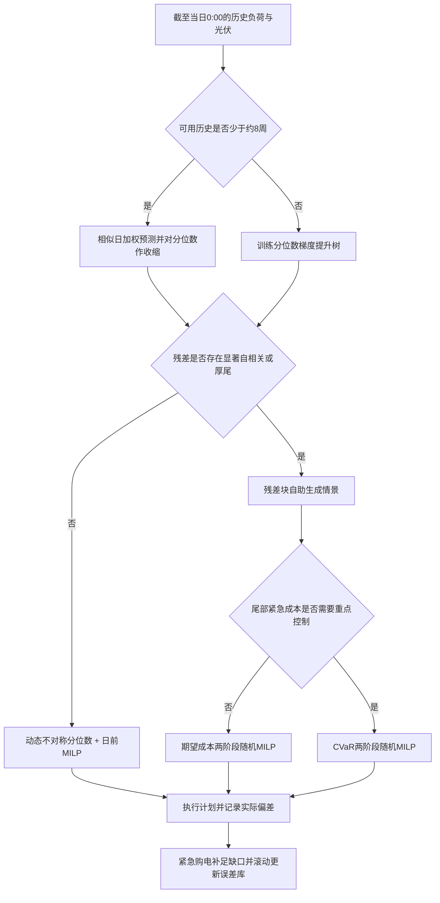
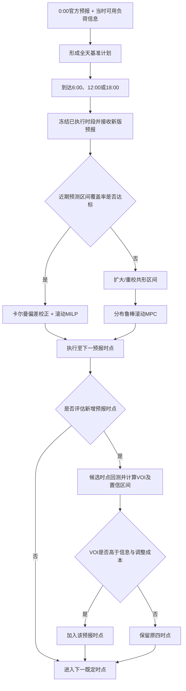
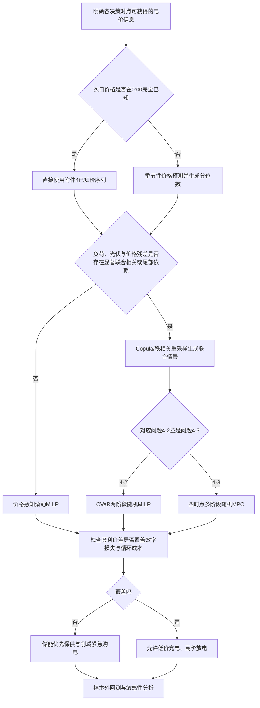

# 三、模型选择阶段：问题二至问题四

> 本文只完成模型选择与路线冻结，不包含正式代码求解。所有预测与回测必须按时间顺序进行，任一日的决策只能使用该时点之前可获得的信息。

## 1. 数据特征与选型依据

现有预处理结果表明：全年负荷、光伏和波动电价均有 52560 个 10 分钟记录，无数值缺失；附件 3 有 35040 条逐小时光伏预报记录。负荷的日滞后、周滞后相关系数分别约为 0.679 和 0.985，光伏分别约为 0.992 和 0.990，说明相似日与周期特征具有很强解释力。波动电价变异系数约为 0.445，日滞后和周滞后相关系数约为 0.934 和 0.982，既有稳定周期，也存在较大幅度波动。

附件 3 的光伏预测误差并非独立噪声：误差一阶相关系数约为 0.706；预测步长为 0—6、6—12、12—18、18—24 小时时，平均绝对误差约为 56、145、226、320 kW。故问题三和问题四应按预测步长校正偏差，并在情景生成时保留误差的连续性。

## 2. 问题二：日前计划与 5 倍紧急购电

### 方案 1（基础适配）：相似日加权预测 + 不对称分位数修正 + 日前 MILP

**核心原理。** 先从历史中寻找星期属性、季节和近期负荷形态相近的若干天，对其负荷和光伏曲线加权平均，得到次日 144 个时段的基准预测；再根据历史“实际净负荷减预测净负荷”的误差分布，把计划从均值调整到偏高分位数。最后把该预测送入问题一的混合整数线性规划，联合决定购电和储能充放电。因为缺口需要按 5 倍电价紧急购买，模型宁可适度多计划，也不应只追求平均预测最准。

**适配性。** 数据具有极强周周期，且 2 月 1 日开始输出时可用训练历史较短；相似日法在小样本、无天气变量时比复杂深度模型更稳定。分位数修正直接对应“少买的代价远大于多买”的非对称损失，MILP 又可原样继承问题一的 SOC、功率、互斥和能量平衡约束。

**创新点。** 不固定使用某个经验分位数，而是按时段、季节和近期误差动态选择分位数；同时用滚动窗口更新相似日权重，并加入动态安全 SOC 下限，使早间计划为晚高峰和预测误差保留储能缓冲。

**局限性。** 没有温度、云量等外生变量时，极端天气和节假日的相似日可能失配；分位数过高会造成计划购电过量，若题面不允许售电，剩余电量只能用于充电或弃光。训练初期样本少，分时段分位数需要收缩到全局分位数以防过拟合。

### 方案 2（创新融合）：分位数梯度提升树 + 残差块自助情景 + CVaR 两阶段随机 MILP

**核心原理。** 用分位数梯度提升树学习时间、星期、近期滞后、滚动统计等特征与负荷/光伏之间的非线性关系，输出多条可能的净负荷分位数曲线；再从历史残差中按连续时间块抽样，生成保留阴云持续和负荷峰值延续性的全天情景。第一阶段在 0:00 决定日前购电，第二阶段在不同实际情景下进行储能调度和紧急购电，并用 CVaR 约束最坏一部分高成本情景。

**适配性。** 题目本质是“先计划、后观察、再补救”的两阶段决策，且 5 倍紧急价格造成明显尾部风险；情景随机优化能同时考虑平均成本和极端缺电，不必把全部不确定性压成一个点预测。

**创新点。** 将概率预测、保留时间相关性的块自助法和风险度量嵌入同一个可解释优化框架；情景权重可随季节与近期预测表现动态更新，并通过情景缩减控制计算量。

**局限性。** 模型质量依赖残差库，年初历史不足时情景多样性有限；情景数、CVaR 置信水平和风险权重会影响答案，必须做敏感性分析。多情景二元规划的计算量显著高于方案 1。

### 问题二应用流程

**建议。** 方案 1 作为正式基线和可解释保底方案；方案 2 作为推荐主模型。若方案 2 的样本外成本改善不显著或求解时间过长，则以方案 1 为最终提交模型，并把方案 2 作为对照实验。

## 3. 问题三：四时点预报、滚动调整与预测信息价值

### 方案 1（基础适配）：卡尔曼偏差校正 + 滚动时域 MILP（MPC）

**核心原理。** 每天 0:00 用首次光伏预报形成全天计划；到 6:00、12:00、18:00 时，将最新预报与已观测实际光伏比较，用卡尔曼更新估计当前预报偏差，再重新优化尚未执行的时段，只执行下一段决策。目标函数分别核算原计划购电费、下调部分 0.5 倍违约费、上调新增部分 1.5 倍电费和最终紧急购电费，已执行时段全部冻结。

**适配性。** 问题三给出的四个发布时间天然符合模型预测控制“获得新信息—重算剩余区间—仅执行当前动作”的结构。附件 3 的误差随预测步长明显增大且连续相关，在线偏差校正能利用当天刚发生的误差改善后续预报。

**创新点。** 在经典滚动 MILP 上加入按“发布时间×预测步长”分组的自适应卡尔曼增益、动态安全 SOC 下限和终端储能价值；用显式正负调整变量严格表达非对称结算，防止计划费用与调整费用重复计算。

**局限性。** 卡尔曼更新更适合缓慢变化、近似线性的偏差；突发云团导致的跳变可能无法及时跟踪。若不同预报版本的定义或可调整区间理解错误，结算会出现系统性偏差，因此正式求解前必须冻结信息时序与计费口径。

### 方案 2（创新融合）：保序共形区间 + 分布鲁棒 MPC + 预测信息价值（VOI）

**核心原理。** 先对官方光伏预报按发布时间和预测步长做偏差校正，再用滚动共形预测生成具有样本外覆盖保证的误差区间；优化时不只针对若干固定情景，而是在与历史数据相近的一组概率分布中寻找最不利成本，得到分布鲁棒的滚动计划。是否增加其他预报时点，则比较“加入该时点后期望总成本的下降”与获取、通信和调整成本，计算预测信息价值。

**适配性。** 本题要求判断是否增加预测时点，仅比较 MAE 不足以回答经济问题；VOI 能直接量化新增预报对总购电费的边际贡献。共形区间对误差分布形状要求较少，适合含大量夜间零光伏、白天异方差和厚尾误差的数据。

**创新点。** 将“预测可靠度—鲁棒调度—信息时点选择”闭环联立：区间宽度随发布时间和步长变化，鲁棒半径随近期覆盖误差动态调整；新增时点通过边际经济价值和置信区间筛选，而不是主观增加。

**局限性。** 分布鲁棒模型较保守，鲁棒半径过大会提高计划购电量；共形有效性依赖校准窗口内数据近似稳定，强季节切换时需分季节或加权校准。若题目未给新增预报的实际成本，只能给出盈亏平衡阈值而非唯一“增加/不增加”结论。

### 问题三应用流程

**建议。** 方案 1 用于准确复现题目结算和建立强基线；方案 2 作为推荐主模型，其中 VOI 是回答“是否需要其他时刻预报”的核心。新增时点优先测试长预测区间内误差增长最快、且净负荷或电价敏感度较高的时段，而不是机械地等间隔加密。

## 4. 问题四：波动电价下重算问题二与问题三

### 方案 1（基础适配）：季节性电价预测/已知价序列 + 价格感知滚动 MILP

**核心原理。** 若 0:00 已知次日完整电价，则直接将固定电价替换为 144 个时变价格，并在 MILP 中按各时段价格计算计划、上调、下调和紧急购电费用；若只知道当前及历史价格，则使用带日/周季节项和滚动残差修正的 SARIMAX 预测次日价格，再滚动重算。储能不仅补偿光伏和负荷偏差，还会在低价时充电、高价时放电，但全过程仍受 SOC、效率和功率约束。

**适配性。** 电价具有强日周周期，因此季节性模型可作为透明稳定的基线；价格感知 MILP 与问题一至三结构兼容，只需替换成本系数并增加电价信息集，能够分别生成 result4-2 和 result4-3。

**创新点。** 加入价格预测置信区间驱动的套利门槛：只有预期价差覆盖充放电效率损失、电池等效循环成本和预测风险缓冲时才套利；终端 SOC 价值随未来预期价格动态变化，避免在年末或滚动窗口末端透支储能。

**局限性。** SARIMAX 对突发价格尖峰响应较慢；如果附件 4 在决策时是否完全已知未被明确，假定方式会显著影响结果。忽略电池衰减会夸大高频套利收益，循环成本参数需做敏感性分析。

### 方案 2（创新融合）：负荷—光伏—电价联合 Copula 情景 + 风险感知多阶段随机 MPC

**核心原理。** 分别预测负荷、光伏和电价的边际分布，再用 Copula 或秩相关残差重采样把三者连接成联合情景，使高负荷、低光伏和高电价可能同时出现。问题 4-2 用两阶段风险优化决定日前计划和紧急补救；问题 4-3 用多阶段随机 MPC 在四个预报时点更新情景树，并用 CVaR 控制“高价且缺电”情景的损失。

**适配性。** 波动电价使预测误差的经济后果与发生时刻强相关，仅分别预测三个变量再独立抽样会低估复合风险。联合情景既能体现储能套利，也能反映极端情况下储能保供价值，并统一覆盖问题二结构和问题三结构。

**创新点。** 引入跨变量尾部依赖、价格—SOC 联动安全储备和情景树滚动缩减；风险权重可根据未来电价上分位数与净负荷缺口概率动态调整，使储能在普通时段重经济性、在高价缺电时段重韧性。

**局限性。** 联合尾部关系需要较多历史数据，复杂 Copula 在一年样本上可能估计不稳；多阶段情景树容易规模爆炸，必须做情景缩减和求解时间控制。模型解释难度高于方案 1，需用消融实验说明联合相关性和 CVaR 的真实贡献。

### 问题四应用流程

**建议。** 方案 1 是必须实现的可解释基线；方案 2 作为推荐主模型，但先检验三变量残差的秩相关和尾部共现。如果联合依赖不显著，则不要为了“创新”强行使用 Copula，改用各变量分位数的块自助联合重采样即可。

## 5. 全题最终模型组合建议

| 小问 | 基础适配方案 | 创新融合方案 | 推荐定位 |
|---|---|---|---|
| 问题二 | 相似日加权预测 + 动态分位数 + 日前 MILP | 分位数树 + 块自助情景 + CVaR 两阶段随机 MILP | 方案 2 主模型，方案 1 基线与降级路线 |
| 问题三 | 卡尔曼偏差校正 + 滚动 MILP/MPC | 共形区间 + 分布鲁棒 MPC + VOI | 方案 2 主模型，方案 1 用于结算校验 |
| 问题四 | 季节性价格预测/已知价 + 价格感知滚动 MILP | 联合 Copula 情景 + 风险感知多阶段随机 MPC | 先检验联合依赖；显著则用方案 2，否则方案 1 |

为保持论文主线统一，建议最终统一表述为：**因果概率预测（分位数/共形区间）→相关误差情景→风险感知滚动 MILP/MPC→预测信息价值评估**。三个小问共享能量平衡、SOC 递推、充放电互斥、容量与功率约束，仅在信息更新频率、计费规则和电价是否波动上分层扩展。

## 6. 下一阶段必须先确认的建模口径

1. 问题二至四在每天 0:00 是否已知当天完整负荷，还是必须自行预测；当前按“只能用历史信息预测负荷”处理。
2. 问题四的当天完整波动电价是否在 0:00 已知；代码应保留“完全已知”和“仅历史可见”两种信息集开关。
3. 问题三的“调整购电量”是新的总购电计划，还是相对于 0:00 计划的增减量；当前建议用正负偏差变量建模并逐项核对总费用，避免重复计价。
4. 问题二至四采用跨日 SOC 连续，当前实现使用全年末 SOC 回归 6000 kWh；不逐日强制 0:00 与 24:00 相等。逐日前推求解并非全年一次性联合优化，问题二与问题四日前分支仍可能出现单日视野终端效应，相关结果应表述为因果滚动策略结果而非全年联合优化理论下界。
5. 默认允许免费弃光、不允许向外网售电；充、放电效率主方案均取 0.90，往返效率 0.90 作为敏感性方案。
