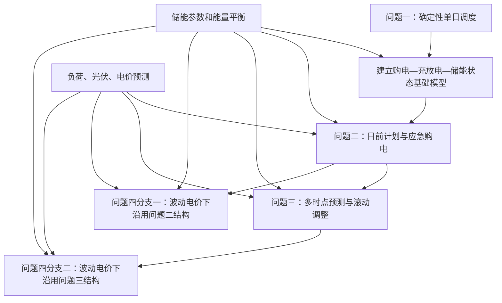
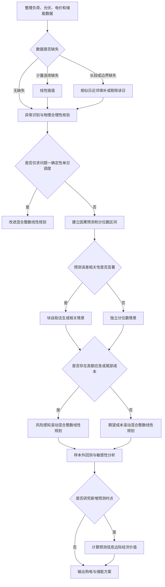

# 数学建模项目记忆文档

> **当前状态（2026-09-12）**：当前工作副本为 `D:\users\dsktop\26-C-master (2)\26-C-master`。问题一至问题四的建模、求解、结果分析和模型检验已完成；问题二至问题四正式采用动态净负荷分位数日前分支、附件3四时点滚动分支和统一混合整数物理层。模型选择文档与自动生成的求解说明已同步当前方案。论文主稿已经退出本项目范围并归档，本项目不再维护论文正文。

> 用途：供后续对话快速恢复本项目上下文。继续工作前，应先读取本文件，并结合 `C题.pdf`、原始附件及已生成的预处理工作簿核验具体数据。

> **跨对话记忆强制规则**：每一个阶段完成后，负责该阶段的对话都必须在结束前更新本文件，至少写明完成状态、关键决策、有效产物、未决问题和下一阶段入口。不同对话窗口开始工作前必须先读取本文件；若新结论与旧记录冲突，应先核验，再用新证据覆盖旧结论并注明原因。

## 一、项目概览

- 赛题：2026 年高教社杯全国大学生数学建模竞赛 C 题《微网与外部电网电力调控策略》。
- 核心任务：在满足小区负荷及储能运行约束的前提下，联合安排外部电网购电与储能充放电，使总购电及相关惩罚成本最小。
- 用户目标：省级一等奖；当前建模路线按冲击国家级一等奖所需的完整性、严谨性和创新性设计。
- 时间粒度：10 分钟，每个功率值换算为该时段电量时乘以 `1/6` 小时。

## 二、项目文件与已有产物

### 原始文件

- `C题.pdf`：题目正文。
- `附件.zip`：题目数据附件原始压缩包。
- `附件/`：唯一保留的原始附件解压目录。
- `working/`：数据预处理脚本、中间数据与质检材料。

### 已生成文件

- `outputs/01a08ae9-b1f2-7cb1-8533-3abdadca9c5b/数据预处理结果.xlsx`
  - 包含 10 个工作表：`说明与汇总`、`缺失值汇总`、`异常值汇总`、`异常值明细`、`附件1处理后`、`标准化参数`、`全年实际处理后`、`光伏预测处理后`、`数据补充建议`、`异常检测图表`。
  - 含 4 张可编辑异常检测图。
  - 已验证工作表数量、数据行数、图表数量和公式结果。
  - 原始附件未被覆盖。

## 三、题目结构与各小问关系

- 问题一：确定性单日基础模型，建立物理约束和成本最小化框架。
- 问题二：继承问题一的物理模型，增加每日 0:00 日前购电计划及高价应急购电。
- 问题三：继承问题二，在 0:00、6:00、12:00、18:00 获取光伏预测并滚动调整，同时研究是否值得增加预测时点。
- 问题四：不是简单接在问题三之后，而是包含两个并列分支：波动电价下的问题二结构，以及波动电价下的问题三结构。

## 四、题型分类

| 小问 | 主类型 | 辅助类型 | 判断依据 |
|---|---|---|---|
| 问题一 | 单目标优化 | 机理约束建模 | 决策购电和充放电，使成本最小，并满足储能及功率平衡约束 |
| 问题二 | 单目标优化 | 时序预测、两阶段决策 | 先制订日前计划，实际偏差通过应急购电补救 |
| 问题三 | 单目标优化 | 多阶段滚动决策、预测信息评价 | 多次获得新预测并调整计划，还需评价新增预测时点的经济价值 |
| 问题四 | 单目标优化 | 电价预测、情景分析 | 在波动电价下联合考虑购电时机、储能套利与预测误差 |

说明：成本中即使包含购电费、应急购电费、偏差惩罚等多个部分，仍是一个加总后的单目标优化问题，不属于多目标优化；本题也不属于指标体系评价类。

## 五、统一参数与基础约束

- 储能最大容量：12000 千瓦时。
- 初始储能：2025-01-01 00:00 为 6000 千瓦时。
- 允许运行范围：1200～10800 千瓦时。
- 最大充电功率：5000 千瓦。
- 最大放电功率：5000 千瓦。
- 充放电效率：题目给出 90%，但需明确其含义是单程效率还是往返效率。
- 问题一明确要求 0:00 与 24:00 储能相等。
- 问题二至问题四不应机械地逐日强制首末储能相等，应保持跨日状态连续，并采用全年末状态约束或终端储能价值。
- 必须满足每个时段的供需平衡、储能状态递推、功率上限和储能上下界。
- 建议加入充放电互斥二元变量，避免同一时段同时充电和放电。
- 建议加入弃光变量，并暂定“允许免费弃光、不允许向外部电网售电”；最终论文中应明确该假设。

## 六、整体推荐建模路线

整体框架定为：

> 动态加权分位数预测 → 相关误差情景生成 → 风险感知滚动混合整数线性优化 → 预测信息价值评估

### 1. 动态加权分位数集成预测

- 核心原理：将相似日方法、季节性时间序列模型和梯度提升树的预测结果组合，根据近期误差、季节、时刻和预测步长动态调整权重，并输出多个分位数而非单一预测值。
- 适配性：负荷、光伏和电价均具有明显日周期、季节性和短期波动；分位数预测能描述不确定性，并配合高额应急购电成本采取偏保守计划。
- 创新点：采用随时段和预测步长变化的动态权重；对负荷使用偏高分位数、对光伏使用偏低分位数，以体现上下偏差成本不对称。
- 局限性：极端天气样本不足时，尾部分位数不稳定；相似日和树模型也会受外部特征缺失影响。

### 2. 基于残差块自助法的相关情景生成

- 核心原理：从历史预测残差中按连续时间块抽样，构造多条可能的负荷、光伏和电价路径，再通过聚类压缩为少量代表性情景。
- 适配性：储能调度受连续多个时段误差累积影响，独立随机误差无法反映阴云持续、负荷高峰延续等相关性。
- 创新点：保留时间相关性，并可进一步保留负荷、光伏和电价之间的联合相关性；情景缩减兼顾真实性和计算效率。
- 局限性：历史中未出现过的结构性极端事件难以被重现；情景数量过少会损失尾部风险，过多则增加求解时间。

### 3. 风险感知滚动混合整数线性规划

- 核心原理：在每个可决策时点，根据最新预测重新优化剩余时段的购电及储能计划，只执行最近一段决策；利用二元变量保证充放电互斥，并将平均成本与尾部风险共同纳入目标。
- 适配性：问题三天然是多阶段滚动决策，问题二和问题四也可作为该框架的简化版本；线性结构便于得到可解释、可复现的全局最优解。
- 创新点：加入动态安全储能下限、条件风险价值、终端储能价值以及小额电池等效循环成本，避免模型透支未来储能或频繁无效充放电。
- 局限性：混合整数变量和多情景会增加计算量；结果对预测分布、风险系数及终端价值参数较敏感。

### 4. 预测信息价值评估模型

- 核心原理：比较增加某个预测时点前后的期望总成本差，只有预计节约超过调整费用或偏差惩罚时，才认为该时点具有实际经济价值。
- 适配性：直接回答问题三“是否需要增加预测时点”，避免只用预测误差下降来替代经济效益判断。
- 创新点：用调度成本的边际改善衡量预测价值，并给出置信区间，而非仅比较均方误差。
- 局限性：若题目没有给出获取额外预测的成本，只能先计算理论价值，再对不同信息成本做敏感性分析。

### 模型使用决策流程

## 七、问题一模型对比与最终选择

| 模型 | 优点 | 主要不足 | 定位 |
|---|---|---|---|
| 线性规划 | 求解快、全局最优、结构清晰 | 难以严格禁止同一时段同时充放电 | 基准模型和成本下界 |
| 混合整数线性规划 | 可通过二元变量严格表达充放电互斥，结果精确且便于扩展 | 计算量略高于线性规划 | 正式主模型，综合最优 |
| 动态规划 | 状态转移直观，适合独立验证储能策略 | 储能离散带来误差，扩展后有维数灾难 | 典型日稳健性验证 |
| 遗传算法等启发式算法 | 易处理复杂非凸目标 | 无法保证全局最优、参数依赖强、复现性较弱 | 不建议作为主模型 |

问题一最终推荐：采用“含充放电互斥、弃光变量、终端储能相等约束及小额循环成本的改进混合整数线性规划”。线性规划作为下界对照，动态规划作为独立验证。深度学习、强化学习和遗传算法不宜作为本题主线模型。

## 八、各问题的主要成本规则

- 问题一：按给定电价计算外部电网购电成本，满足单日首末储能相等。
- 问题二：每天 0:00 制订计划；实际缺口通过应急购电弥补，应急购电价格为交易时刻电价的 5 倍。
- 问题三：在 0:00、6:00、12:00、18:00 获得新预测并调整计划；下调部分按交易电价的 0.5 倍承担偏差成本，上调新增电量按交易电价的 1.5 倍计费。需仔细建立结算口径，避免重复计价。
- 问题四：将固定或给定电价替换为波动电价，并分别嵌入问题二、问题三结构。

## 九、数据结构与预处理结论

### 数据规模

- 附件 1：1 个工作表，144 条 10 分钟记录，包含时刻、电价、小区负荷、光伏预测功率；数值完整。
- 附件 2：2 个工作表，分别为小区负载和光伏发电实际功率；各为 `365×144`，合并后共 52560 个时间点。
- 附件 3：365 天、每天 4 个预测发布时间，共 1460 行；每次含未来 24 小时逐小时预测，长表化后共 35040 条记录。
- 附件 4：365 天、每天 144 个时间点，共 52560 条波动电价记录。

### 缺失值

- 数值型缺失值为 0。
- 附件 3 中有 1095 个日期空白单元格，是同一天 6:00、12:00、18:00 行省略或合并日期造成的结构性空白，已向下填充日期。
- 年末有 36 个预测目标时刻超出附件 2 实际光伏数据范围，对应实际值保持为空，并从预测误差评估中排除。
- 后续若出现缺失：不超过 3 个连续 10 分钟内部缺口用线性插值；更长或边界缺口用相似日近邻填补；超过 2 小时或整日缺失时优先追溯原数据或剔除该日，不使用全局均值填补。

### 异常值

- 采用四分位距法检测。
- 附件 1：0 个候选异常。
- 全年负荷：8 个候选异常，占约 0.02%。
- 全年实际光伏：564 个候选异常，占约 1.07%。
- 波动电价：236 个候选异常，占约 0.45%。
- 光伏预测：253 个候选异常，占约 0.72%。
- 合计候选异常：1061 个。
- 附件 1 按变量整体检测；全年数据按同月、同时刻分组检测；预测数据按月份、发布时间和预测步长分组检测。
- 所有候选异常均保留并加标记，未直接删除或修正，因为这些数值可能对应真实负荷峰值、云层扰动或电价跳变。建模时应通过稳健损失、情景法或敏感性分析降低其影响。

### 数据转换

- 优化模型继续使用千瓦、千瓦时和电价原始物理单位，不进行标准化。
- 距离类及机器学习预测模型采用标准分数标准化：`标准值 =（原值－训练集均值）/训练集标准差`。
- 标准化参数仅用 1 月训练数据计算，避免未来数据泄漏。
- 未采用极差归一化，因为极端值会明显改变范围，且调度模型需要保留物理量纲。
- 已构造日内时刻和年内日期的正余弦周期特征。
- 已构造 10 分钟电量字段：`电量 = 功率/6`。

## 十、必须明确的假设与补充信息

### 必须补充或在论文中明确

1. 90% 是充电与放电各自的单程效率，还是电池总往返效率。
2. 是否允许弃光；是否允许向外部电网售电。
3. 外部电网是否存在最大购电功率。
4. 每个决策时点能够获得哪些信息，尤其是问题二和问题四是否提前知道未来负荷、电价。
5. 问题三调整购电量的精确结算规则，以避免原计划电量与增减量重复计费。
6. 问题二至问题四的年末储能状态或终端储能价值规则。
7. 新增预测时点是否存在信息获取成本。

### 无法获得官方补充时的建议假设

- 主方案将充电效率和放电效率均设为 90%，并把“90% 为往返效率”作为敏感性方案。
- 允许免费弃光，不允许向外部电网售电。
- 若题目未给购电功率上限，则主模型暂不设上限，并增加有限上限的敏感性分析。
- 所有预测严格遵守因果性，只使用当时及以前可获得的数据。
- 问题二至问题四保持储能跨日连续，采用全年首末状态相等或终端价值处理。
- 新增预测时点先按零获取成本计算理论信息价值，再改变信息成本进行敏感性分析。

### 可选外部数据

- 温度、云量、太阳辐照度和降水等天气数据。
- 工作日、周末、法定节假日和特殊活动信息。
- 电池循环寿命、衰减曲线和等效循环成本。
- 电价发布机制及实际结算规则。

## 十一、结果文件要求

- `result1.xlsx`：问题一每 10 分钟计划购电量、充放电汇总及 0:00/24:00 储能状态。
- `result2.xlsx`：问题二 2 月 1 日至 12 月 31 日的计划购电、充放电和应急购电时段。
- `result3.xlsx`：问题三计划购电、调整后购电、最终充放电及最终应急购电。
- `result4-2.xlsx`：问题四中采用问题二结构的结果。
- `result4-3.xlsx`：问题四中采用问题三结构的结果。
- 论文重点展示日期：2025-03-20、2025-06-21、2025-09-23、2025-12-21。

## 十二、后续工作优先级

1. 问题一改进混合整数线性规划及 `results/result1.xlsx` 已完成，问题一论文正在撰写。
2. 问题二至问题四的双方案模型选择已完成，详见 `docs/三_模型选择阶段.md`；下一阶段应冻结信息集与计费口径，再进入代码实现。
3. 问题二先实现“相似日 + 动态分位数 + 日前 MILP”基线，再实现“分位数树 + 相关情景 + CVaR 两阶段随机 MILP”主模型。
4. 问题三先用“卡尔曼校正 + 滚动 MILP”核对结算，再实现“共形区间 + 分布鲁棒 MPC + VOI”并评价新增预报时点。
5. 问题四先明确次日电价在 0:00 是否已知；分别实现问题 4-2 与 4-3，并在联合依赖显著时启用负荷—光伏—电价联合情景。
6. 统一进行严格的时间顺序样本外回测、敏感性分析、消融实验和典型日期可视化。
7. **每完成上述任一阶段，必须立即更新本项目记忆文档后再结束对应对话。**

## 十三、论文创新与验证建议

- 创新主线控制在 2～3 个核心点：动态不对称分位数、相关情景生成、动态风险储能或预测信息价值。
- 至少设置以下对照：无储能、规则调度、确定性线性规划、确定性混合整数线性规划、风险感知滚动模型。
- 报告指标包括：总成本、应急购电成本、应急购电量、弃光率、储能循环次数、尾部成本、求解时间。
- 做关键参数敏感性分析：效率、初始储能、容量、功率上限、应急价格倍数、风险权重、终端价值和预测误差。
- 做消融实验，分别移除动态权重、相关情景、风险项和终端价值，证明各改进模块的实际贡献。

## 十四、下一段对话的接续提示

新对话开始时，可直接要求助手：

> 请先读取项目根目录的《项目记忆.md》、`docs/三_模型选择阶段.md` 和预处理工作簿，在已有模型选择与数据结论基础上继续，不要重新从零分析。当前优先任务是：〔填写问题二代码实现、问题三代码实现、问题四代码实现、结果分析或论文撰写等〕。阶段结束前必须再次更新《项目记忆.md》记录进度和接续入口。

若记忆文档与题目原文、实际数据或后续计算结果冲突，应以重新核验后的题目与数据为准，并同步更新本文件。

## 十五、模型选择阶段完成记录（2026-09-11）

- 有效产物：`docs/三_模型选择阶段.md`。
- 完成范围：问题二、问题三、问题四各给出 2 种模型方案，均包含核心原理、适配性、创新点、局限性与带决策点的 Mermaid 流程图。
- 数据证据：负荷周滞后相关约 0.985；光伏日/周滞后相关约 0.992/0.990；波动电价变异系数约 0.445、日滞后相关约 0.934；附件 3 光伏预测误差一阶相关约 0.706，0—6 小时至 18—24 小时的 MAE 约由 56 kW 增至 320 kW。
- 统一主线：因果概率预测（分位数/共形区间）→相关误差情景→风险感知滚动 MILP/MPC→预测信息价值评估。
- 推荐选择：问题二采用 CVaR 两阶段随机 MILP 为主、动态分位数日前 MILP 为基线；问题三采用分布鲁棒 MPC + VOI 为主、卡尔曼滚动 MILP 为结算校验；问题四先检验三变量联合依赖，显著时采用联合情景多阶段随机 MPC，否则采用价格感知滚动 MILP。
- 未决口径：负荷是否需要预测、问题四次日电价的可见性、问题三调整费用的精确定义、全年末 SOC 规则、效率的单程/往返含义、弃光与售电规则。
- 下一阶段入口：先固定上述口径，再从问题二基础方案开始实现，建立严格按时间顺序的训练—预测—调度—回测流水线。

## 十六、问题二至问题四完整建模说明完成记录（2026-09-11）

- 新建固定建模交付物：`题目分析报告.md`、`术语表格.md`。
- 完成范围：统一物理层、问题二 CVaR 两阶段随机 MILP、问题三卡尔曼基线与共形区间—Wasserstein 分布鲁棒 MPC—VOI 主模型、问题四联合情景与波动价两/多阶段模型。
- 已冻结主口径：10 分钟功率乘 1/6 转电量；日前计划固定；问题三按逐次增量结算调整；跨日 SOC 连续并用全年末回归约束；主方案充放电效率各 0.90；允许弃光、不允许售电。
- 保留敏感性分支：问题三最终相对原计划结算、往返效率 0.90、有限并网功率、问题四已知价与仅历史可见价两类信息集。
- 当前阶段不包含问题二至四代码、运行结果或正式图表，任何数值结论仍须由编程阶段真实运行产生。
- 下一入口：先完成 M1 独立建模终检；通过后读取编程手 Skill，从问题二最小可运行链开始实现，并在 P1 通过后再开展全量回测。

- M1 首次独立终检返回 FAIL：发现问题四预测价误入真实结算、问题二储能阶段口径冲突、DRO 确定性等价与 Big-M/阶段变量不完整。已按证据返工：问题四全部费用按情景/实际交易价结算；问题二储能改为带节点非预见性的因果补救；补充有限支持 Wasserstein 运输对偶、无量纲距离、场景补救约束、有限 Big-M 与完整变量表。等待 M1 复验。
- M1 第二次复验仍为 FAIL：继续补充问题四 Wasserstein 距离的价格维度；用过滤族 F_t 固定“观测当前负荷/光伏/SOC后再执行本时段动作”的顺序；将跨日 SOC 改为上一日真实终值固定下一日全部根场景；在 Q3 确定性等价中补齐调整演化、历史冻结、根状态和范围约束。等待再次复验。
- M1 第三次独立复验 PASS（2026-09-11）：权威快照 `题目分析报告.md` SHA-256=`044F39EFFD2262CB6FDE5F730E133012DA74A5D397547F9E1685084CCD925585`，`术语表格.md` SHA-256=`7959C3DAAC8284AE322BD58AB03524B18E2D1EEE607B5D5693EB1D73D4A59183`。无 P0/P1；P2 为后续论文避免把因果多阶段补救简称普通两阶段、补全基础文献标识、并列报告年末 SOC 边界敏感性。可进入问题二编程阶段及 P1 门禁。

## 十七、问题二至问题四模型检验完成记录（2026-09-11）

- 新增独立报告 `问题二至四_模型检验.md`，未修改两份论文主稿。
- 新增复现脚本 `q234_validate.py`，完成五折时间顺序预测检验、四策略逐时段独立回代，以及正负 10% 负荷/光伏扰动的执行压力检验。
- 四个策略的供需平衡、SOC 递推和费用对账最大误差均在 `4.55e-12` 量级以内，SOC 边界及充放电互斥检验全部通过。
- 问题二负荷和光伏预测均未优于周滞后基线，当前预测模块不能判为完全有效；问题三及问题四滚动分支的光伏预测 RMSE 相对基线改善约 58.10%，但负荷预测仍略逊于基线。
- 10% 随机扰动并冻结后续动作时，日前分支成本平均增加约 5.4%，滚动分支约增加 12.0%—12.3%；滚动策略经济性较好，但备用较少，须用继续滚动重优化、CVaR 或 SOC 安全带增强抗扰能力。
- 问题四结论仍限于“当天完整电价路径在 0:00 已知”；若实际为逐时发布，必须加入因果电价预测后重新回测。
- 机器可读明细位于 `results/问题二至四模型检验/`。下一阶段应优先改进问题二预测器、问题三负荷预测器，并以时间顺序样本外总成本重新选参。

## 十八、AI自查表逻辑性必改项核定（2026-09-11）

### 本次核定范围

- 依据 `2026数学建模国赛AI自查表_已核查（第2至4项）.docx`、当前 `q234_solve.py`、`模型假设.md`、`问题2至4_求解说明.md`、`docs/三_模型选择阶段.md` 与已有结果文件进行只读核对。
- 本节记录的是已经确认的逻辑性必改项；模型改进建议、扩展方案和未完成的系统调参不等同于逻辑错误。
- 若本节与前文的“推荐模型”或早期“尚未实现”记录冲突，以当前实际代码和本节核定结论为准。

### 必须修改的四项内容

1. **统一问题二至问题四的模型类别。** 当前 `q234_solve.py` 调用 `scipy.optimize.linprog`，实现的是连续线性规划，没有二元变量。现有材料中把问题二至问题四写成混合整数线性规划或滚动 MILP 的表述与代码不一致，必须改为当前真实实现；问题一使用混合整数规划的表述不受影响。
2. **纠正“具有充放电互斥约束”的表述。** 当前问题二至问题四代码没有硬性互斥约束，只在充、放电变量上加入小额吞吐惩罚。已有结果中同时充放电时段数为 0，只能证明当前输出未出现同充同放，不能证明模型用二元变量严格保证互斥。必须修改相关模型说明，或在代码中真正加入互斥约束后重算。
3. **纠正吞吐惩罚的作用说明。** `0.005 元/kWh` 同时乘以充电量和放电量并直接进入单层目标函数，因此可能改变购电费用最优方案，不能称为“仅在同成本方案之间排序”。若要保留该文字含义，应改成先最小化购电相关费用、再在第一阶段最优费用容差内最小化吞吐量的两阶段词典序优化；若保留现有代码，则必须如实说明这是加权目标，并补充系数影响检验。
4. **更新自查表对跨日 SOC 的问题描述。** 当前代码将前一日实际末 SOC 传给次日，并同时要求每日末 SOC 回到当日初值，两条约束可以同时成立，不构成“跨日状态不连续”的逻辑矛盾。应改为：当前采用“跨日连续且每日首末相等”的保守边界，该边界限制跨日能量转移和跨日套利，因此所得费用不是允许自由跨日优化时的理论最低值。

### 不列为逻辑性必改项

- `0.80/0.20` 是正式基准分位数，`0.88/0.18` 是已经完成的敏感性试算，两组参数并存不构成逻辑矛盾。已有试算表明 `0.88/0.18` 在所测组合中成本更低，但它尚未通过完整参数网格和独立样本外选参，因此不能直接称为最终最优参数。
- 每日首末 SOC 相等本身是可选择的保守建模假设，不是内部逻辑错误；必须限制结论口径，不能把相应结果写成自由跨日调度的全年理论最优值。
- 当前各正式策略的输出均未出现同时充放电，数值事实成立；需要修改的是“模型通过二元变量或硬约束保证互斥”的错误解释。

### 后续修改边界

- 最小必改范围是修正文档和自查表中的模型类别、互斥机制、吞吐惩罚用途及跨日 SOC 描述。
- 若决定把问题二至问题四改成真正的混合整数规划、把吞吐量处理改成两阶段词典序优化，或放宽每日首末 SOC 约束，则属于代码与模型变更，必须重新求解并同步更新结果、图表、检验和论文数字。
- 分位数系统选参属于定稿前应完成的模型验证任务，不应误写为尚未考虑 `0.88/0.18`；准确口径是“已经试算但尚未正式选定”。

### 既定模型方向补充确认

- 用户确认本项目最初确定的方向是以混合整数线性规划贯穿问题一至问题四。该方向作为后续修改的约束，覆盖本节前文“修改文档或修改代码二选一”的开放表述：不得为迁就当前连续线性规划实现而把问题二至问题四的正式模型说明降格为线性规划，应修改代码使实现与既定模型一致。
- 问题二至问题四的统一物理层必须加入逐时段充放电状态二元变量，并以有限功率上界约束充电量和放电量，从数学上严格禁止同一时段同时充放电。该约束应同时覆盖问题二日前计划、问题三四时点滚动调整、问题四两个分支及新增预测时点的信息价值对照方案。
- 吞吐量处理应采用两阶段词典序优化：第一阶段严格最小化题目规定的计划购电、调整和紧急购电费用；第二阶段在第一阶段最优费用或严格限定的数值容差内最小化充放电总吞吐量。原 `0.005 元/kWh` 加权惩罚不得继续被解释为仅对同成本方案排序；若无电池衰减标定依据，不应把它作为真实货币成本混入第一阶段目标。
- 将问题二至问题四从连续线性规划升级为混合整数线性规划后，现有结果即使未出现同时充放电也不能直接沿用。必须重新生成并核对 `result2.xlsx`、`result3.xlsx`、`result4-2.xlsx`、`result4-3.xlsx`，以及逐时段结果、逐日统计、运行摘要、图表、模型检验和敏感性结果。
- 跨日 SOC 边界与模型是否含整数变量相互独立。当前“跨日连续且每日首末相等”可以作为保守边界暂时保留，但必须明确它限制跨日能量转移，不能把所得费用称为自由跨日调度下的全年理论最优值。
- 分位数 `0.88/0.18` 已经完成敏感性试算，不属于此前遗漏；是否替换正式基准 `0.80/0.20`，应在混合整数版本完成后通过时间顺序样本外选参决定。

## 十九、问题二至问题四四项逻辑修订完成记录（2026-09-12）

- `q234_solve.py` 已由连续 `linprog` 改为 `scipy.optimize.milp`，问题二、问题三、问题四两个分支及八时点信息价值对照均使用统一混合整数物理层。
- 每个时段新增充、放电状态二元变量，通过有限功率上界联动和状态和不超过 1 的约束，从数学上严格禁止同时充放电。
- 原 `0.005 元/kWh` 加权吞吐惩罚已从首层目标删除。当前采用两层词典序优化：第一层只最小化题目规定费用，第二层在首层最优费用容差内最小化总吞吐量。
- 问题二至问题四取消每日首末 SOC 相等约束，保持相邻日期实际 SOC 连续，仅在整个计算区间最后一天约束回到 6000 kWh。独立审计显示四种策略跨日衔接残差均为 0，问题三固定价和问题四滚动分支分别有 169 天和 150 天日初日末 SOC 不同。
- 已完成全年重算。正式评价期新总成本为：问题二固定价 17225566.14 元、问题三固定价 16130891.40 元、问题4-2波动价 18068303.48 元、问题4-3波动价 16864403.38 元；八时点代理毛信息价值为 -71161.01 元。
- 已重新生成四个正式结果工作簿、逐时段结果、逐日汇总、运行摘要、五张图和问题2至4求解说明；已有 6 项单元测试通过，独立回代显示供需和 SOC 残差处于约 `10^-12` kWh 以内，无同时充放电，全年末 SOC 均约为 6000 kWh。
- 限制：问题二和问题4-2仍是只优化当天的因果日前策略。取消每日回归后虽允许跨日状态传递，但其结果不是具有全年未来信息的一次性联合最优；正式定稿前应以多日滚动窗口或终端价值检验单日视野终端效应，并在混合整数版本上重新完成分位数样本外选参。
- `main.tex` 与 `论文草稿/main.tex` 本次未修改。自查表原文件因被占用无法原位保存，修订内容另存为 `2026数学建模国赛AI自查表_已核查（第2至4项）_模型修订版.docx`。

## 二十、动态净负荷分位数滚动回测（2026-09-12）

- 独立试验脚本现归档于 `archive/废弃文件_论文撰写阶段/旧基准与独立试验/q234_dynamic_quantile.py`。外层按日使用严格早于决策日的数据，在60天训练窗口中选择20个相似日，并用最近14个已实现验证日的运行成本从0.50至0.95候选集中选择净负荷分位数；负荷与光伏按同一历史日成对构造净负荷，避免分别取分位数造成双重保守。
- 现有附件没有天气、节假日、云量和辐照度字段，因此第一版相似日仅使用星期类型、近期净负荷形态和时间衰减；外层验证为控制嵌套混合整数规模采用1小时聚合，最终执行仍保持10分钟粒度。
- 正式评价区间为2025年2月1日至12月31日。方法C滚动净负荷分位数总成本为16413518.08元，相比方法A“负荷0.80减光伏0.20”的17225566.14元下降4.71%；紧急购电率由2.24%降至1.68%，日成本CVaR95由91472.80元降至81760.58元。
- 方法C所选分位数均值0.808、中位数0.85，正式评价期变更11次；结果证明不应直接把0.80/0.20或0.88/0.18写成未经样本外回测的最终参数。
- 方法D按小时无条件重排计划的总成本为17705078.11元，比方法A高2.78%，但日成本CVaR95降至72069.13元。原因是频繁计划调整触发题目规定的上调、下调结算费用；下一步必须增加“预计节省超过调整成本才执行”的触发门槛，再决定是否采用日内滚动。
- 该阶段的机器可读比较、回测说明及图现归档于 `archive/废弃文件_论文撰写阶段/旧基准与独立试验/动态分位数/`，作为正式方案纳入前的独立试验历史记录。

## 二十一、动态净负荷分位数纳入正式基准（2026-09-12）

- `q234_solve.py` 的正式日前流程已直接采用动态净负荷分位数：问题二按固定电价历史成本滚动选参，问题4-2按波动电价历史成本滚动选参；候选分位数为0.50至0.95、步长0.05，使用60天训练窗、20个相似日和14天验证窗，选择过程严格只使用决策日前已经实现的数据。
- 原负荷0.80分位数减光伏0.20分位数不再作为正式问题二及问题4-2基准；模型检验已经同步当前动态净负荷分位数方案。问题三和问题4-3继续使用附件3的0/6/12/18时点预测机制，不属于固定0.80/0.20方案的覆盖范围。
- 正式评价期当前总成本为：问题二固定价16413518.08元、问题三固定价16130891.40元、问题4-2波动价17148794.62元、问题4-3波动价16864403.38元。四时点滚动相对日前策略的降幅分别为1.72%和1.66%。
- 问题二所选分位数均值0.808、中位数0.85、变更11次；问题4-2所选分位数均值0.806、中位数0.85、变更8次。四种策略均通过正式求解器内置的供需平衡、SOC递推、边界、互斥、跨日衔接和成本对账检查。
- 已覆盖正式结果工作簿、逐时段结果、逐日汇总、运行摘要、图表、求解说明、结果分析统计和 `docs/七_结果分析阶段.md`。当时涉及 `main.tex` 的同步记录不再代表当前项目边界；主稿随后已经退出本项目范围并归档。
- `results/问题二至四模型检验/`、`问题二至四_模型检验.md` 和AI自查表已在第二十二节所记阶段完成同步，现可作为动态净负荷分位数正式方案的检验证据。

## 二十二、模型检验同步与论文文件退出当前范围（2026-09-12）

- `q234_validate.py` 的问题二及问题4-2预测检验已由固定负荷0.80、光伏0.20分位数改为动态净负荷分位数五折时间顺序回测；`results/问题二至四模型检验/` 的三张CSV和检验摘要已用当前正式结果重算。
- 四种策略均通过供需平衡、SOC递推、SOC边界、充放电互斥、跨日衔接与费用对账。动态日前分支在正负10%冻结压力情景下平均成本增加约6.6%，滚动分支约增加12.0%至12.3%。
- `问题二至四_模型检验.md` 和AI自查表已覆盖为当前动态分位数正式基准口径；自查表保留唯一当前版本 `2026数学建模国赛AI自查表_已核查（第2至4项）_模型修订版.docx`。
- 本项目边界调整为只负责论文撰写前的建模、求解、结果分析与模型检验。根目录 `main.tex`、`论文草稿/`、论文编写说明、旧版论文草稿、旧自查表及相关中间文件统一移入 `archive/废弃文件_论文撰写阶段/`。

## 二十三、模型选择和求解说明同步（2026-09-12）

### 完成状态

- `docs/三_模型选择阶段.md` 已由候选方案推荐文档整理为候选方案比较与最终选型文档。正式方案明确为：问题二和问题4-2采用动态净负荷分位数日前混合整数规划，问题三和问题4-3采用附件3的0、6、12、18时点滚动混合整数规划。
- 条件风险价值两阶段随机规划、分布鲁棒优化、Copula、卡尔曼校正、动态安全 SOC 下限和终端储能价值等早期建议继续保留为历史候选与后续扩展，但已明确不属于当前实现，旧推荐已被当前正式方案取代。
- `q234_solve.py` 的说明生成函数及生成后的 `问题2至4_求解说明.md` 已补齐训练窗、相似日数、验证窗、候选步长、风险与稳定参数、分位数统计、经济比较、检验结论和适用条件。
- 自动生成原则：所有会随正式求解变化的总成本、分位数统计、经济差额和求解器内置校验均由当前运行数据计算；独立五折与压力检验结论明确标注来源和失效条件。以后不得只人工修改生成后的说明文件。

### 本次同步范围

1. `docs/三_模型选择阶段.md`。
2. `q234_solve.py` 中 `write_notes` 说明生成函数及其调用。
3. 自动生成产物 `问题2至4_求解说明.md`。
4. 本项目记忆的状态、归档路径和失效说明。

本次未修改模型数学逻辑，未重新求解，未覆盖结果表、图表、模型检验、自查表或第一问文件。
