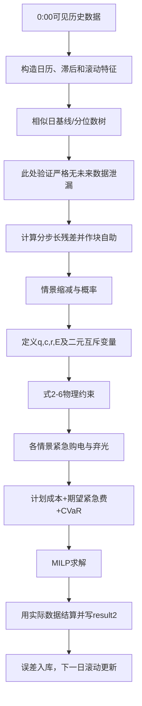
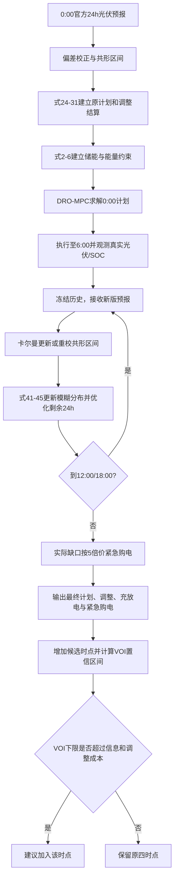
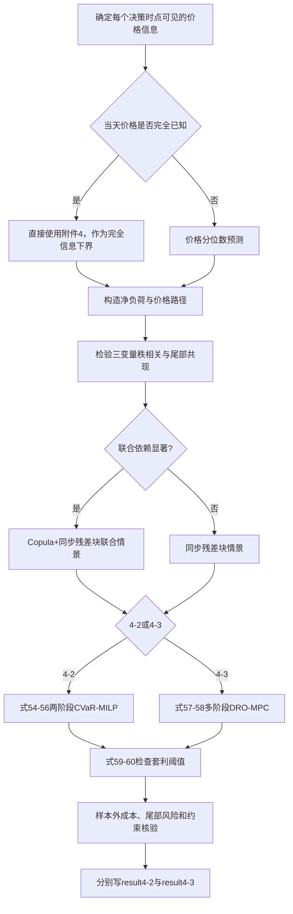

# 题目分析报告：问题二至问题四完整建模说明

> 赛题：2026 年高教社杯全国大学生数学建模竞赛 C 题《微网与外部电网电力调控策略》  
> 当前阶段：建模手（只完成数学模型合同，不给出未经代码运行的数值结果）  
> 使用边界：本文是建模草稿，提交前必须由参赛队逐式核对、人工改写并与真实程序结果一致。

## 1. 任务边界与统一建模思想

第一问已经完成，本文只建立问题二、问题三和问题四的模型。三问共享同一套“购电—光伏—负荷—储能”物理内核，区别只在信息何时到达、购电计划能否调整以及价格是否随时间变化。因此不把三问写成彼此无关的模型，而按以下层次递进：

1. 问题二：0:00 一次决策，形成全天计划；真实净负荷高于计划供给时用 5 倍电价紧急购电。
2. 问题三：在问题二物理模型上加入 6:00、12:00、18:00 三次信息更新和非对称调整结算，并用预测信息价值判断是否增加预报时点。
3. 问题四：把固定日内电价替换为 10 分钟波动电价；分别重算问题二结构（4-2）和问题三结构（4-3），同时考虑电价不确定性与储能套利。

统一逻辑链为：


## 2. 题目、数据和输出合同

### 2.1 输入文件与数据质量

| 文件 | 主要字段 | 规模 | 用途 | 处理原则 |
|---|---|---:|---|---|
| `附件1.xlsx` | 固定日内电价、负荷、光伏预测 | 144 个 10 分钟时段 | 问题二和三的固定电价 | 保持原单位；功率乘以 1/6 转为时段电量 |
| `附件2.xlsx` | 2025 年实际负荷、实际光伏 | 各 365×144 | 训练、滚动回测和最终结算 | 52560 个键无重复、无数值缺失 |
| `附件3.xlsx` | 每日 0/6/12/18 时发布的未来 24 小时整点光伏预报 | 1460 次发布、35040 条长表记录 | 问题三和 4-3 的信息更新 | 日期结构性空白向下填充；年末 36 条无对应实际值不参加误差评价 |
| `附件4.xlsx` | 全年 10 分钟波动电价 | 52560 条 | 问题四 | 不平滑尖峰；保留并在稳健模型中处理 |
| `附件5/*.xlsx` | 结果模板 | 5 个模板 | 编程阶段写出结果 | 原模板只读，另存到 `results/` |

预处理事实：负荷、光伏和波动电价均无数值缺失；全年负荷、光伏、电价的 IQR 候选异常率分别约为 0.015%、1.073%、0.449%，均保留并加标记。附件 3 的光伏预报误差一阶相关约为 0.706；预测步长从 0—6 h 增至 18—24 h 时，MAE 约从 56 kW 增至 320 kW。因此误差不能被视为独立同分布白噪声，情景生成必须保留连续性并按预测步长分层。

### 2.2 子问题模型合同

| 合同项 | 问题二 | 问题三 | 问题四 |
|---|---|---|---|
| 任务定义 | 每日 0:00 制定 144 时段购电和储能策略，缺口紧急购电 | 0:00 制定计划，6/12/18 时滚动调整；评价新增预报时点 | 在波动价下分别重算问题二和问题三 |
| 结论类型 | 计划购电、充放电、SOC、紧急购电及成本 | 原计划、每次调整、最终调度、紧急购电、VOI | 4-2 与 4-3 的完整策略、成本和套利行为 |
| 主模型 | 分位数预测 + 相关情景 + CVaR 两阶段随机 MILP | 共形区间 + Wasserstein 分布鲁棒 MPC + VOI | 联合残差情景 + 风险感知两/多阶段 MPC |
| 基线/回退 | 相似日 + 0.8 附近动态分位数 + 日前 MILP | 卡尔曼偏差校正 + 滚动 MILP | 已知价/季节性价格预测 + 价格感知 MILP |
| 主要验证 | 时间顺序回测、确定性/随机模型对比 | 覆盖率、滚动成本、VOI 置信区间 | 价格预测、联合依赖、套利阈值、尾部成本 |
| 失败回退 | 情景模型无样本外改进或求解超时则退回基线 | DRO 过保守或不可解则退回卡尔曼 MPC | 联合依赖不显著则不用 Copula，采用同步块重采样 |

## 3. 统一符号、时间尺度与物理模型

### 3.1 索引和集合

- (d\in\mathcal D=\{1,\ldots,365\})：日期；正式输出问题二至四为 2 月 1 日至 12 月 31 日，1 月作为热启动和训练期。
- (t\in\mathcal T=\{1,\ldots,144\})：一天内第 (t) 个 10 分钟时段。
- Δt = 1/6 h：一个时段长度。
- (s\in\mathcal S=\{1,\ldots,S\})：不确定情景，概率为 π_s，且 \(\sum_s\pi_s=1\)。
- (k\in\mathcal K=\{0,1,2,3\})：问题三的决策时点，分别对应 0:00、6:00、12:00、18:00。
- τ_k：第 (k) 次决策开始影响的第一个 10 分钟时段。

### 3.2 参数

| 参数 | 含义 | 单位/取值 |
|---|---|---|
| (L_{dt},P^{pv}_{dt}) | 实际负荷功率、实际光伏功率 | kW，均非负 |
| (e^L_{dt},e^{pv}_{dt}) | 10 分钟负荷电量、光伏电量 | kWh，分别为 (L_{dt}\Delta t,P^{pv}_{dt}\Delta t) |
| (p_{dt}) | 交易时刻电价 | 元/kWh；问题二、三按附件1日内重复，问题四按附件4 |
| (E^{min},E^{max}) | 储能允许下、上界 | 1200、10800 kWh |
| (E^{cap}) | 铭牌容量 | 12000 kWh |
| (P^{max}) | 最大充/放电功率 | 5000 kW |
| (C^{max},D^{max}) | 单时段最大充/放电量 | (5000/6=833.333\) kWh |
| η_c,η_d | 充电、放电效率 | 主方案均取 0.90 |
| κ | 电池等效循环成本系数 | 元/kWh，通过敏感性分析取值 |
| β | 终端储能价值 | 元/kWh，由窗口后预期边际电价估计 |
| α | CVaR 置信水平 | 基准 0.95，扫描 0.90—0.99 |
| λ | 尾部风险权重 | 非负，通过样本外验证选择 |

### 3.3 决策变量、中间变量和目标变量

| 类别 | 符号 | 含义 | 类型 | 单位 | 约束范围 |
|---|---|---|---|---|---|
| 决策 | (q_{dt}=q^{(0)}_{dt}) | 0:00 根节点制定的计划购电量 | 连续 | kWh | (0≤q_{dt}≤M^q_{dt})，跨根节点情景一致 |
| 决策/补救 | (c_{dts},r_{dts}) | 情景/节点上的储能充电量、从储能端取出的放电量 | 连续 | kWh | (0≤c_{dts},r_{dts}≤833.333) |
| 决策/补救 | (u^c_{dts},u^d_{dts}) | 情景/节点上的充、放电状态 | 0-1 | 无量纲 | ({0,1}) |
| 状态 | (E_{dts}) | 情景/节点上时段开始的储电量 | 连续 | kWh | [1200,10800] |
| 补救 | (g^{em}_{dts}) | 情景 (s) 下紧急购电量 | 连续 | kWh | (g^{em}_{dts}\ge0) |
| 中间 | (w_{dts}) | 弃光/不可利用剩余能量 | 连续 | kWh | (w_{dts}\ge0) |
| 调整 | (a^+_{dtks},a^-_{dtks}) | 情景/节点上第 (k) 次相对上一有效计划的上、下调量 | 连续 | kWh | [0,M^q]，仅对未执行时段有效 |
| 调整 | (q^{(k)}_{dts}) | 情景/节点上第 (k) 次调整后的有效购电计划 | 连续 | kWh | [0,M^q] |
| 调整 | (z_{dtks}) | 上调/下调互斥选择 | 0-1 | 无量纲 | ({0,1}) |
| 参数 | (M^q_{dt}) | 计划量及调整量的物理—经济有效上界 | 常数 | kWh | (M^q=\bar e^L+C^{max}) |
| 风险 | ζ,ξ_s | VaR 辅助量、CVaR 超额损失 | 连续 | 元 | ξ_s≥0 |
| 目标 | (J) | 计划、调整、紧急、循环和风险成本之和 | 连续 | 元 | 最小化 |

### 3.4 基础物理方程的推导

功率数据必须先转成电量。对任一 10 分钟时段：

\[
e^L_{dt}=L_{dt}\Delta t,\qquad e^{pv}_{dt}=P^{pv}_{dt}\Delta t. \tag{1}
\]

式 (1) 的物理意义是“功率×持续时间=能量”，避免把 kW 直接与 kWh 相加。

以 (c_{dts}) 表示从微网母线送入电池的电量，以 (r_{dts}) 表示从电池内部取出的电量，则 SOC 递推为

\[
E_{d,t+1,s}=E_{dts}+\eta_c c_{dts}-r_{dts}, \tag{2}
\]

负荷端实际得到的放电量为 η_d r_dt。该定义把两次效率放在不同位置，单位最清楚；若后续改成“r 表示负荷端放电量”，则式 (2) 必须改为 (E_{t+1}=E_t+\eta_cc_t-r_t/\eta_d)，两种口径不能混用。

场景 (s) 的母线能量平衡为

\[
q_{dt}+g^{em}_{dts}+e^{pv}_{dts}+\eta_d r_{dts}
=e^L_{dts}+c_{dts}+w_{dts}. \tag{3}
\]

式 (3) 表示“外网计划电量+紧急电量+光伏+电池放电=负荷+充电+弃光”。引入 (w\) 可确保光伏过剩且储能已满时仍有可行解；由于不允许售电，(w\) 不能取负。

储能边界与互斥约束为

\[
E^{min}\le E_{dts}\le E^{max}, \tag{4}
\]

\[
0\le c_{dts}\le C^{max}u^c_{dts},\quad
0\le r_{dts}\le D^{max}u^d_{dts},\quad
u^c_{dts}+u^d_{dts}\le1. \tag{5}
\]

式 (5) 用二元变量严格排除同一时段同时充放电。若去掉二元变量，循环成本通常能抑制但不能数学上保证互斥，所以只可作为求解速度对照。

在逐日滚动实现中，跨日连续的是唯一真实执行路径，不是两个独立日情景集里同名的 s。设上一日实际终值为 (E^{real}_{d-1,145})，则下一日所有情景的根状态固定为

\[
E_{d,1,s}=E^{real}_{d-1,145},\quad\forall s;\qquad E^{real}_{1,1}=6000. \tag{6}
\]

正式输出从 2 月 1 日开始，但应先用 1 月数据从 6000 kWh 热启动到 2 月 1 日，不能任意重置。为防止模型在年末无成本地耗尽储能，采用

\[
E^{real}_{365,145}=6000. \tag{7a}
\]

作为全年主约束，并用终端价值

\[
-\beta E_{d,145,s} \tag{7b}
\]

作为滚动窗口内的近似；二者做敏感性对照，而不逐日强制 (E_{d,145}=E_{d,1})。若一次性构造全年情景树，则式 (7a) 改为每条保留场景路径的年末状态回归 6000；逐日重采样模型不得跨日复用场景下标 s。

## 4. 统一假设及合理性

| 编号 | 级别 | 假设 | 合理性 | 放宽与复验方式 |
|---|---|---|---|---|
| H1 | 关键 | 每个时刻只能使用当时及以前已获得的数据，预测和调度严格因果 | 防止把全年真实数据泄漏到日前计划；符合题目“每天0:00制定” | 做时间顺序滚动回测，任何随机划分结果不得作为主结论 |
| H2 | 关键 | 不允许向外网售电；允许免费弃光 | 题目只描述购电，没有售电价格；弃光变量保证过剩时可行 | 加入售电价 0—购电价的情景，比较策略变化 |
| H3 | 关键 | 问题三每次已接受的调整成为下一次调整的结算基线；历史时段冻结 | 符合滚动交易和不可逆时间顺序，避免对同一增减量重复结算 | 以“最终计划相对0:00原计划”口径重算，列为结算敏感性 |
| H4 | 可放宽 | 充、放电单程效率均为 0.90 | 题面仅说充放电效率90%，单程含义最直接且保守 | 与往返效率90%，即 η_c=η_d=√0.9，对照 |
| H5 | 可放宽 | 外网计划购电和紧急购电无额外功率上限 | 题面未给并网容量；任意添加会改变可行域 | 以 5、8、10 MW 等合理并网容量做扫描 |
| H6 | 可放宽 | 储能衰减可用单位吞吐量线性成本 κ(c+r) 近似 | 一年期、固定设备容量下适合控制无效高频循环 | 令 κ=0 并与分段线性寿命成本对照 |
| H7 | 可放宽 | 预测残差在相邻短窗口内局部稳定，但允许季节和步长异方差 | 共形/块自助需要可交换或弱稳定条件；数据表明误差随步长变化 | 分月、发布时间、步长校准；用覆盖率漂移触发窗口缩短 |

## 5. 问题二：日前计划与五倍紧急购电

### 5.1 模型准备：净负荷预测

定义净负荷电量

\[
n_{dt}=e^L_{dt}-e^{pv}_{dt}. \tag{8}
\]

#### 5.1.1 基线：相似日加权预测

在当日 (d) 的历史集合 ℓ_d 中，只选 (j<d) 的日期。构造相似度距离

\[
D(d,j)=\omega_1 I(\text{weekday}_d\ne\text{weekday}_j)
+\omega_2|\sin(2\pi m_d/365)-\sin(2\pi m_j/365)|
+\omega_3\|\mathbf n_{d-1}-\mathbf n_{j-1}\|_2/\sigma_n. \tag{9}
\]

权重为

\[
\rho_{dj}=\frac{\exp[-D(d,j)/h]}{\sum_{l\in\mathcal N_K(d)}\exp[-D(d,l)/h]}, \tag{10}
\]

于是基准预测

\[
\hat n^{mean}_{dt}=\sum_{j\in\mathcal N_K(d)}\rho_{dj}n_{jt}. \tag{11}
\]

式 (9)—(11) 的意义是利用强周周期和邻近日形态，在年初训练样本不足时获得可解释预测。

#### 5.1.2 主预测：分位数梯度提升树

特征只包括当时可用的日历变量、时刻正余弦、1/7/14 日滞后、滚动均值与滚动波动。对分位数 τ，最小化 pinball 损失

\[
\hat f_\tau=\arg\min_f\sum_{(d,t)\in\mathcal I_{train}}
\rho_\tau(n_{dt}-f(\mathbf x_{dt})),\quad
\rho_\tau(u)=u[\tau-I(u<0)]. \tag{12}
\]

如果暂不考虑储能跨时段耦合，计划 1 kWh 的边际成本为 (p)，少计划后紧急补 1 kWh 的边际成本为 (5p)，则报童模型的一阶条件为

\[
p-5p\Pr(n>q)=0\Rightarrow F_n(q)=0.8. \tag{13}
\]

所以 τ=0.8 是动态分位数的理论起点，而不是拍脑袋参数。由于储能、弃光和跨时段价格会改变边际代价，最终 τ 应在滚动训练窗中按真实总成本选择，并按时段/季节向 0.8 收缩。

### 5.2 相关情景生成

计算各历史日的分位数中心预测残差向量

\[
\boldsymbol\varepsilon_d=(n_{d1}-\hat n_{d1},\ldots,n_{d,144}-\hat n_{d,144}). \tag{14}
\]

从同季节历史中按长度 (B\) 的连续块抽取残差并拼接到 144 个时段：

\[
n_{dts}=\hat n_{dt}+\varepsilon^{*(s)}_{dt}. \tag{15}
\]

净负荷允许为负，表示光伏超过负荷；不能在式 (15) 中截断为零。块长 (B) 用残差自相关衰减位置和样本外成本共同选取，候选 6、12、18、36 个 10 分钟点。相比逐点独立抽样，式 (15) 能保留阴云持续和负荷峰延续。若优化直接使用净负荷，式 (3) 等价写成 (q+g^{em}+\eta_dr=n+c+w)；若分别使用负荷和光伏，则必须对二者残差同步重采样。生成较多原始情景后，用 k-medoids 按日曲线距离缩减至 (S) 个代表情景，簇样本占比作为 π_s。

### 5.3 两阶段随机 MILP

第一阶段（0:00 决定）只锁定全天计划购电 (q_t)。定义过滤族 (F_t) 为“时段 t 开始时可用的全部信息”：测得当前储电量 (E_t)，并获得本时段负荷和光伏的短时实现/计量值，随后决定本时段充放电和紧急购电；本时段结束后状态转移到 (E_{t+1})。因此时段内顺序为“观测 (L_t,P^{pv}_t,E_t) → 决定 (c_t,r_t,g_t^{em}) → 能量平衡 → 更新 (E_{t+1})”。补救变量可以依赖 F_t，但不能利用 F_t 之后的信息。把情景组织成逐时揭示的情景树，并施加节点非预见性

\[
y_{ts}=y_{ts'},\quad\forall y\in\{c,r,E,u^c,u^d,g^{em},w\},
\quad\text{若 }s,s'\text{ 在 }\mathcal F_t\text{ 上不可区分}. \tag{15a}
\]

因此这是“日前计划 + 因果运行补救”的两阶段经济结构，同时具有多时段信息揭示；不会让储能调度提前知道当天真实情景。若实际控制系统要求充放电也在 0:00 完全锁定，可将 c、r、u、E 跨全部情景设为相同，作为更保守的敏感性分支。

计划成本与电池吞吐成本：

\[
C^{plan}=\sum_t p_t q_t. \tag{16}
\]

情景 (s) 的补救损失：

\[
R_s=\sum_t\left[5p_tg^{em}_{ts}+\kappa(c_{ts}+r_{ts})\right]. \tag{17}
\]

期望成本模型为

\[
\min J_2^{RN}=C^{plan}+\sum_s\pi_s(R_s-\beta E_{145,s}). \tag{18}
\]

为控制“连续低光伏+高负荷”造成的极端应急费，引入 CVaR：

\[
\operatorname{CVaR}_\alpha(R)=
\zeta+\frac{1}{1-\alpha}\sum_s\pi_s\xi_s, \tag{19}
\]

\[
\xi_s\ge R_s-\zeta,\qquad \xi_s\ge0. \tag{20}
\]

最终主目标为

\[
\boxed{\min J_2=C^{plan}+\sum_s\pi_sR_s
+\lambda\operatorname{CVaR}_\alpha(R)-\beta\sum_s\pi_sE_{145,s}}. \tag{21}
\]

式 (21) 中 λ=0 是风险中性模型；λ 增大时模型愿意增加适量计划购电或保留 SOC 来压低尾部紧急费。约束为式 (2)—(6)，并对每个情景使用式 (3) 和节点非预见约束 (15a)。

### 5.4 动态安全 SOC 下限（可选增强）

根据从当前时段到下一关键高峰的累计净负荷预测误差上分位数 (Q_{1-\gamma})，定义

\[
B_t=\min\left\{E^{max}-E^{min},
Q_{1-\gamma}\left[\sum_{\tau=t}^{h(t)}(n_\tau-\hat n_\tau)_+\right]/\eta_d\right\}, \tag{22}
\]

并令

\[
E_t\ge E^{min}+B_t. \tag{23}
\]

式 (23) 是“风险缓冲”而不是永远抬高 SOC；晴朗且预测稳定时 (B_t) 小，误差大或临近晚高峰时 (B_t) 增大。若导致成本明显上升且尾部风险无改善，则删去该增强项。

### 5.5 问题二建模流程图



### 5.6 验证与失败条件

- 按日期扩展窗口回测，任何一天只使用前序数据；报告总成本、计划费、紧急费、紧急电量、弃光率、等效循环次数和求解时间。
- 对照无储能、规则储能、点预测 MILP、动态分位数 MILP、风险中性随机 MILP、CVaR 随机 MILP。
- 检查每个时段的能量平衡残差小于 (10^{-6}) kWh，SOC 与功率约束无违反，二元互斥无违反。
- 若主模型相对基线的样本外总成本没有稳定下降，或 95% 尾部成本无改善，或单日求解超过预设上限，则以基线作为正式模型，主模型只作对照。

## 6. 问题三：四时点预报、滚动调整与信息价值

### 6.1 信息结构与调整变量

令 (q^{(0)}_{dt}) 为 0:00 根节点计划。第 (k\ge1) 次更新仅能修改尚未执行的时段；为便于先解释一条实际路径，式 (24)—(31) 暂省略情景下标 s，随机/DRO 主模型中恢复为 (q^{(k)}_{dts},a^{\pm}_{dtks},z_{dtks}) 并施加式 (46) 非预见约束：

\[
q^{(k)}_{dt}=q^{(k-1)}_{dt}+a^+_{dtk}-a^-_{dtk},\quad t\ge\tau_k, \tag{24}
\]

\[
a^+_{dtk}a^-_{dtk}=0. \tag{25}
\]

式 (25) 可用二元变量 (z_{dtk}) 线性化：

\[
0\le a^+_{dtk}\le Mz_{dtk},\quad
0\le a^-_{dtk}\le M(1-z_{dtk}). \tag{26}
\]

这里不能取任意巨大的 M。因附件4价格均为正、禁止售电，单时段理性购电不会超过“最大可能负荷电量+最大充电量”，故定义场景支持内负荷上界

\[
\bar e^L_{dt}=\max\left\{\max_s e^L_{dts},\ 1.2\max_{j<d}e^L_{jt}\right\},\qquad
M^q_{dt}=\bar e^L_{dt}+C^{max}. \tag{26a}
\]

于是式 (26) 中 (M=M^q_{dt})，并补充 (0≤q^{(k)}_{dt}≤M^q_{dt})。历史最大负荷 7978.8849 kW 对应 1329.814 kWh/时段；若仅用该历史上界，则 (M^q≈2163.147 kWh)，加入 20% 支持外推时约为 2429.111 kWh。编程时采用实际场景支持逐时计算的紧上界，而非固定 10^6。

对 (t<\tau_k)，令 (q^{(k)}_{dt}=q^{(k-1)}_{dt}) 且 (a^+=a^-=0)，表示历史决策冻结。实际执行计划为该时段开始前最近一次有效版本

\[
\tilde q_{dt}=q^{(k(t))}_{dt},\quad k(t)=\max\{k:\tau_k\le t\}. \tag{27}
\]

### 6.2 调整结算公式

0:00 计划费用：

\[
C_0=\sum_t p_tq^{(0)}_t. \tag{28}
\]

第 (k\ge1) 次调整费用：

\[
C_k^{adj}=\sum_{t\ge\tau_k}
\left(1.5p_ta^+_{tk}+0.5p_ta^-_{tk}\right). \tag{29}
\]

紧急购电费用：

\[
C^{em}=\sum_t5p_tg^{em}_t. \tag{30}
\]

于是一次实际路径的总购电相关费用为

\[
C^{buy}=C_0+\sum_{k=1}^3C_k^{adj}+C^{em}. \tag{31}
\]

式 (31) 明确采用“每次增量单独结算”口径。若赛题解释为“最终调整量只相对 0:00 计划结算一次”，只需把式 (24) 改成 (q^{final}=q^{(0)}+a^+-a^-)，并把式 (29) 仅计算一次；其余物理模型不变。两种口径必须在敏感性分析中对照。

### 6.3 基线模型：卡尔曼偏差校正 + 滚动 MILP

附件 3 给出整点光伏预报，先按“发布时间×预测步长”估计偏差状态。令官方预报误差观测为

\[
y_h=P^{pv,act}_h-P^{pv,off}_h=b_h+v_h, \tag{32}
\]

偏差状态演化为

\[
b_h=b_{h-1}+w_h,\quad w_h\sim(0,Q_h),\quad v_h\sim(0,R_h). \tag{33}
\]

卡尔曼预测—更新：

\[
\hat b^-_h=\hat b_{h-1},\quad P^-_h=P_{h-1}+Q_h, \tag{34}
\]

\[
K_h=\frac{P^-_h}{P^-_h+R_h},\quad
\hat b_h=\hat b^-_h+K_h(y_h-\hat b^-_h),\quad
P_h=(1-K_h)P^-_h. \tag{35}
\]

校正预报为

\[
\hat P^{pv,corr}_h=\max\{0,P^{pv,off}_h+\hat b_h\}. \tag{36}
\]

将整点预测转为 10 分钟时，使用分段线性或保形插值，并作日内能量校正，使六个 10 分钟点的积分与对应小时预测电量一致。每到 6/12/18 时：读取最新预报、更新式 (35)、冻结过去时段、用式 (24)—(31) 和基础物理约束重新求剩余 24 h，只执行到下一预报时点。

### 6.4 主模型第一部分：滚动共形预测区间

对经偏差校正的点预测，构造按发布时间 (k) 和预测步长组 (h) 标准化的非一致性分数

\[
s_i=\frac{|P^{pv,act}_i-\hat P^{pv,corr}_i|}{\hat\sigma_{k,h,i}+\epsilon}. \tag{37}
\]

在最近 (m) 个因果校准样本上，取有限样本修正分位数

\[
q_{1-\delta}=\operatorname{Quantile}_{\lceil(m+1)(1-\delta)\rceil/m}\{s_1,\ldots,s_m\}. \tag{38}
\]

得到区间

\[
\left[\max(0,\hat P-q_{1-\delta}\hat\sigma),
\hat P+q_{1-\delta}\hat\sigma\right]. \tag{39}
\]

式 (39) 允许白天波动大、夜间接近零，也允许长步长区间更宽。用滚动覆盖率检验 \hat P(P^{act}∈I)≈1-δ；若持续低于目标，则扩大窗口权重或鲁棒半径，而不是继续相信过窄区间。

### 6.5 主模型第二部分：Wasserstein 分布鲁棒 MPC

设当前决策时点收集到 (N) 条残差路径 \hat ξ_i，经验分布为

\[
\hat{\mathbb P}_N=\frac1N\sum_{i=1}^N\delta_{\hat\xi_i}. \tag{40}
\]

所有不确定量先统一成 kWh。对候选路径 i、j，使用无量纲归一化距离

\[
d_{ij}=\frac1H\sum_{t=1}^{H}\left(
\frac{|e^L_{tj}-e^L_{ti}|}{s_L}+
\frac{|e^{pv}_{tj}-e^{pv}_{ti}|}{s_{pv}}+
\chi_p\frac{|p_{tj}-p_{ti}|}{s_p}
\right), \tag{40a}
\]

其中 (s_L,s_{pv},s_p) 仅由当前训练窗的稳健尺度（IQR/1.349，若为 0 则用非零 MAD）计算；问题三固定电价时令 (χ_p=0)，问题四联合价格不确定性时令 (χ_p=1)。因此 (d_{ij}) 和半径 ε 无量纲，后文对偶变量 γ 的单位为元，且价格路径间概率搬运会支付正确的价格距离成本。

以一阶 Wasserstein 距离构造模糊分布集合

\[
\mathcal P_\varepsilon=
\{\mathbb Q:W_1(\mathbb Q,\hat{\mathbb P}_N)\le\varepsilon,
\operatorname{supp}(\mathbb Q)\subseteq\Xi\}. \tag{41}
\]

滚动目标为

\[
\boxed{\min_x\ \max_{\mathbb Q\in\mathcal P_\varepsilon}
\mathbb E_{\mathbb Q}[C^{buy}(x,\xi)+C^{deg}(x,\xi)]-\beta E_H}. \tag{42}
\]

其中 x 是各信息节点的非预见购电/调整决策；每个候选支持路径 j 配置补救变量

\[
y_j=\{c_{tj},r_{tj},E_{tj},u^c_{tj},u^d_{tj},g^{em}_{tj},w_{tj}\}_{t=1}^{H}, \tag{42a}
\]

并逐情景满足式 (2)—(5) 和节点非预见约束 (46)。场景损失明确写为

\[
\ell_j(x,y_j)=C_0(x)+\sum_{k,t}
[1.5p_ta^+_{tk}+0.5p_ta^-_{tk}]
+\sum_t[5p_tg^{em}_{tj}+\kappa(c_{tj}+r_{tj})]-\beta E_{Hj}. \tag{42b}
\]

Ξ 由物理边界和共形区间给定。根据 Wasserstein 对偶，最坏期望可写为

\[
\sup_{\mathbb Q\in\mathcal P_\varepsilon}\mathbb E_\mathbb Q[\ell(x,\xi)]
=\inf_{\gamma\ge0}\left\{\gamma\varepsilon+\frac1N\sum_{i=1}^N
\sup_{\xi\in\Xi}[\ell(x,\xi)-\gamma\|\xi-\hat\xi_i\|_1]\right\}. \tag{43}
\]

为使实现完全确定，采用有限支持运输模型。令 (T_{ij}) 表示经验样本 i 的概率质量搬运到候选路径 j 的量，内层最坏分布为

\[
\max_{T\ge0}\sum_{i,j}T_{ij}\ell_j(x,y_j),\quad
\sum_jT_{ij}=1/N,\quad
\sum_{i,j}d_{ij}T_{ij}\le\varepsilon. \tag{43a}
\]

对式 (43a) 作线性规划对偶，引入自由变量 ν_i 与 γ≥0：

\[
\min_{\gamma\ge0,\nu}\ \gamma\varepsilon+\frac1N\sum_i\nu_i,
\quad \nu_i+\gamma d_{ij}\ge\ell_j(x,y_j),\ \forall i,j. \tag{43b}
\]

这与通用式 (43) 一致。将 Ξ 离散为经块自助和共形边界生成的候选情景 ξ_j，引入 θ_i（即 ν_i）：

\[
\theta_i\ge \ell(x,\xi_j)-\gamma\|\xi_j-\hat\xi_i\|_1,\quad\forall i,j, \tag{44}
\]

即可把式 (42) 转为目标中含

\[
\gamma\varepsilon+\frac1N\sum_i\theta_i \tag{45}
\]

的有限 MILP。完整确定性等价包含：① 目标式 (45)；② 每个支持路径的损失定义 (42b)；③ 每个支持路径的物理约束 (2)—(5) 与变量范围；④ 当前实测根状态 (E_{1j}=E^{meas}_{τ_k})；⑤ 根节点 0:00 计划跨情景一致；⑥ 调整演化、互斥、历史冻结和执行版本式 (24)—(27)；⑦ 跨共享过滤族 F_t 节点的非预见约束 (46)；⑧ 对偶上界 (44)。所有绝对值距离 (d_{ij}) 在求解前由数据计算为常数，所以不会引入双线性项。式 (43)—(45) 的意义是：不相信某一个估计分布，而在“离历史经验分布不太远”的所有分布中按最不利成本决策。

鲁棒半径 ε 不用主观固定，按滚动验证选择：从候选网格中选择使样本外总成本最低且覆盖率达标的最小半径；强季节切换或近期覆盖率下降时允许增大。

### 6.6 MPC 状态转移与非预见性

在时点 τ_k 测得真实 (E_{\tau_k})，优化未来 24 h。对已执行时段所有变量固定；对当前至下一更新时点的决策立即执行；更远期变量仅用于预见终端影响，下一次更新会重算。若使用情景树，同一历史节点上的决策必须相等：

\[
x_{t,s}=x_{t,s'},\quad
\text{若情景 }s,s'\text{ 在过滤族 }\mathcal F_t\text{ 上不可区分}. \tag{46}
\]

式 (46) 防止情景模型出现“预知未来”的虚假低成本。

### 6.7 预测信息价值 VOI

设现有预报时点集合 (A_0=\{0,6,12,18\})，增加候选时点 τ 后，在完全相同的历史日、随机种子、情景和结算规则下回测，定义

\[
\operatorname{VOI}(\tau)=J(A_0)-J(A_0\cup\{\tau\}). \tag{47}
\]

若每次获得预报的通信/服务成本为 (c_f(\tau))，触发重优化和计划变更的管理成本为 (c_a(\tau))，则净价值

\[
\operatorname{NVOI}(\tau)=\operatorname{VOI}(\tau)-c_f(\tau)-c_a(\tau). \tag{48}
\]

题目未给 (c_f,c_a) 时，输出盈亏平衡阈值

\[
c_f(\tau)+c_a(\tau)<\operatorname{VOI}(\tau). \tag{49}
\]

对日级成本差做按周移动块 bootstrap，得到 VOI 的 95% 置信区间。只有区间下限仍大于信息与调整成本，且新增时点没有显著增加求解和操作负担时，才建议加入。候选时点优先取 3:00、9:00、15:00、21:00，并可进一步以小时网格搜索边际 VOI 最大者。

### 6.8 问题三建模流程图



### 6.9 验证与失败条件

- 卡尔曼基线报告 MAE、RMSE、偏差；共形模型同时报告总体和“月份×发布时间×步长”的覆盖率与平均区间宽度。
- 调度对照必须固定同一数据和结算口径：不调整、四时点卡尔曼 MPC、四时点 DRO-MPC、增加候选时点。
- 对 ε、覆盖率 (1-δ)、调整费系数、终端价值、效率做敏感性；做“去掉卡尔曼/共形/DRO/终端价值”的消融。
- 若共形覆盖率系统性不足，先分季节重校；若 DRO 成本明显高但尾部风险不降，减小 ε 或退回 CVaR 情景 MPC；若 VOI 置信区间跨 0，只能结论为“证据不足”，不能强行建议增加。

## 7. 问题四：波动电价下的问题二与问题三

### 7.1 两种电价信息集

题面提供全年实际波动价，但未明确每日 0:00 是否已知当日完整价格。主报告应同时定义：

- 信息集 A（现实主模型）：0:00 只知道历史价格和当时发布信息，需预测未来价格；附件4实际价格只用于事后结算。
- 信息集 B（完全信息下界）：0:00 已知当天 144 个价格，用于衡量“完美价格预测”能达到的成本下界。

不得把信息集 B 的结果写成现实可实现策略。

### 7.2 价格预测基线

采用含日、周季节项的 SARIMAX 或等价梯度提升分位数模型。一个透明基线为

\[
p_t=\mu+\sum_{j=1}^{P}\phi_jp_{t-j}
+\sum_{j=1}^{Q}\Phi_jp_{t-144j}
+\mathbf b^\top\mathbf z_t+\epsilon_t, \tag{50}
\]

其中 z_t 包括时刻正余弦、星期和滚动价格统计。训练与调参仍按日期扩展窗口完成，输出价格分位数而非只给点预测。波动价格变异系数约 0.445，日/周滞后相关约 0.934/0.982，说明周期基线有依据但仍要保留尖峰风险。

### 7.3 负荷—光伏—价格联合情景

令三类标准化残差为 ε^L、ε^pv、ε^p。先分别拟合经验边际分布 \hat F_j，再做概率积分变换

\[
u_{j,i}=\frac{\operatorname{rank}(\varepsilon_{j,i})-0.5}{N}. \tag{51}
\]

以高斯或 t-Copula 表示联合分布：

\[
\mathbf z_i=(\Phi^{-1}(u_{L,i}),\Phi^{-1}(u_{pv,i}),\Phi^{-1}(u_{p,i})),
\quad \mathbf z\sim C_R. \tag{52}
\]

采样后逆变换

\[
\varepsilon_j^{(s)}=\hat F_j^{-1}(u_j^{(s)}), \tag{53}
\]

并把连续时间块同步拼接，生成 (L_s,P^{pv}_s,p_s) 联合路径。只有当滚动训练窗中 Spearman 相关显著（建议同时满足 (p<0.05) 且 |ρ|≥0.1），或高负荷、低光伏、高价格的尾部共现率至少为独立假设的 1.5 倍时，才使用参数 Copula；否则采用同步块自助，不为了复杂而强行拟合 Copula。

### 7.4 问题 4-2：波动价下两阶段模型

在现实信息集下，预测价只用于形成决策；真实/情景交易价必须进入所有费用。场景 s 的总损失为

\[
C_{4-2,s}=\sum_t\left[p_{ts}q_t+5p_{ts}g^{em}_{ts}
+\kappa(c_{ts}+r_{ts})\right]-\beta E_{145,s}. \tag{54}
\]

\[
\operatorname{CVaR}_\alpha(C_{4-2})=
\zeta+\frac1{1-\alpha}\sum_s\pi_s\xi_s,
\quad\xi_s\ge C_{4-2,s}-\zeta. \tag{55}
\]

主目标

\[
\boxed{\min J_{4-2}=\sum_s\pi_sC_{4-2,s}
+\lambda\operatorname{CVaR}_\alpha(C_{4-2})}. \tag{56}
\]

其余约束与式 (2)—(6) 相同。计划购电 q_t 在根节点跨全部价格情景一致；运行变量按已揭示历史满足式 (15a)。完全信息下界只需令 0:00 已知实际价格路径，此时所有价格情景退化为实际路径；它不作为现实主策略。

### 7.5 问题 4-3：波动价下多阶段滚动模型

预测价格只出现在决策信息中，不进入事后成本账。对联合实现情景 s，全部购电、调整和紧急费用均按交易时刻情景价 (p_{ts}) 结算：

\[
C^{buy}_{4-3,s}=\sum_tp_{ts}q_t^{(0)}
+\sum_{k=1}^3\sum_{t\ge\tau_k}
\left[1.5p_{ts}a^+_{tks}+0.5p_{ts}a^-_{tks}\right]
+\sum_t\left[5p_{ts}g_{ts}^{em}+\kappa(c_{ts}+r_{ts})\right]-\beta E_{Hs}. \tag{57}
\]

将负荷、光伏和价格联合误差向量放入式 (41) 的 Wasserstein 模糊集合，得到

\[
\boxed{\min_x\max_{\mathbb Q\in\mathcal P_\varepsilon}
\mathbb E_\mathbb Q[C^{buy}_{4-3}(x,y,\xi)]}. \tag{58}
\]

并按式 (40a)、(42a)—(46) 转换和施加非预见性：根节点的 (q^{(0)}) 跨全部情景相同；第 k 次调整 (a^{±}_{tks}) 只可依赖该节点已揭示的负荷、光伏和价格历史。0/6/12/18 时更新三类预测中在该时刻确实可更新的部分；如果价格发布机制没有新信息，则价格预测保持原版本，不能假装已知实际价格。实际回测时将 (p_{ts}) 替换为附件4的实际价格统一结算式 (57)。

### 7.6 储能套利阈值的推导

若低价时购买 1 kWh 送入电池，未来可向负荷释放 η_cη_d kWh。为了未来得到 1 kWh，需要低价时购买 (1/(\eta_c\eta_d)) kWh。因此忽略风险时，只有

\[
p_{high}>\frac{p_{low}}{\eta_c\eta_d}+\kappa_{delivered} \tag{59}
\]

才值得纯套利。主方案 η_c=η_d=0.9 时，价格比至少需超过 (1/0.81\approx1.2346)，还未计循环成本与预测风险。加入价格不确定性后的保守门槛为

\[
Q_\delta(p_{high})>
\frac{Q_{1-\delta}(p_{low})}{\eta_c\eta_d}
+\kappa_{delivered}+m_{risk}. \tag{60}
\]

式 (60) 可解释为什么某些名义价差看似为正，最优解仍不充放电。

### 7.7 问题四建模流程图



### 7.8 验证与失败条件

- 比较固定价、实际波动价完全信息、可预测价格三种信息集，报告 EVPI（完美信息期望价值）。
- 报告价格 MAE/RMSE/分位数损失与尖峰召回率；联合情景报告边际分布、Spearman 相关、尾部共现和场景覆盖。
- 对照独立情景、同步块情景、Copula 联合情景，检验联合建模是否真正降低高价缺电尾部损失。
- 验证每次纯套利均满足式 (59) 或由保供价值解释；不满足且仍频繁循环时，检查终端价值、效率位置和循环成本。
- 若 Copula 参数不稳、样本外尾部风险不降或求解超时，则退回同步块自助 + CVaR 滚动 MILP。

## 8. 统一求解步骤与伪代码

1. 读取原始附件并核对行数、首尾时间、重复键、单位和非负性。
2. 将功率乘 (1/6) 转为电量；保存原始量纲供优化，不对 SOC/成本变量标准化。
3. 从 1 月 1 日起建立扩展训练窗，所有预测特征只使用当前以前信息。
   - 1 月 1 日无本年度历史时，用附件1的典型日负荷—光伏曲线与设备初始电量 6000 kWh 作为先验基线，不训练机器学习模型；1 月 2 日起优先使用已观测本年度数据，并将分时估计向附件1先验收缩；历史达到 7 日后启用周滞后，达到约 8 周后再允许主预测模型替代相似日基线。
4. 训练基线和主预测，生成分位数/共形区间；按残差连续块生成情景并缩减。
5. 建立式 (2)—(7) 的统一 MILP 物理层。
6. 问题二加入式 (16)—(21)；问题三加入式 (24)—(49)；问题四加入式 (50)—(60)。
7. 用 MILP 求解器设置可接受 MIP gap（如 (10^{-4})）与时间上限；若超时，保存 incumbent 和 gap，不把未证最优解称为全局最优。
8. 在真实路径上顺序执行：只落实当前时段，更新 SOC 和预测误差库，再进入下一时点。
9. 检查能量平衡残差、SOC、功率、互斥、非预见性和结算恒等式。
10. 生成题目指定日期表格及完整 xlsx；所有论文数字必须来自程序输出。

伪代码：

```text
E <- 6000 kWh
for day d = Jan-01 ... Dec-31:
    history <- data strictly before d 00:00
    forecast distributions <- fit/update(history)
    scenarios <- block bootstrap + reduction
    if Q2 or Q4-2:
        solve day-ahead two-stage MILP
        execute fixed day-ahead plan against actual path
    if Q3 or Q4-3:
        for k in {00:00, 06:00, 12:00, 18:00}:
            freeze executed variables
            update forecast, state and ambiguity set
            solve remaining-horizon MPC
            execute only until next update
    settle emergency/adjustment costs and carry E to next day
    append realized residuals to history
report Feb-01 ... Dec-31 and keep January as warm-up evidence
```

## 9. 参数选择、灵敏度、消融和评价指标

### 9.1 参数选择

| 参数 | 候选 | 选择方法 |
|---|---|---|
| 相似日数量 K | 3、5、7、14 | 滚动验证总成本，不只看 RMSE |
| 分位数 τ | 0.70—0.95 | 从理论起点 0.80 扫描，按真实结算成本选 |
| 块长 B | 6、12、18、36 个时段 | 自相关衰减 + 样本外成本 |
| 情景数 S | 10、20、40、80 | 成本稳定性与求解时间折中 |
| CVaR α | 0.90、0.95、0.975、0.99 | 尾部成本与平均成本曲线 |
| 风险权重 λ | 0—1 或成本归一化网格 | 选择拐点并做稳定性分析 |
| 共形失覆盖率 δ | 0.05、0.10、0.20 | 覆盖率与区间宽度折中 |
| DRO 半径 ε | 数据驱动网格 | 选择满足覆盖且成本最低的最小值 |

### 9.2 评价指标

预测层：MAE、RMSE、pinball loss、区间覆盖率、平均区间宽度、价格尖峰召回率。  
调度层：总成本、计划购电费、调整费、紧急购电费、紧急电量、弃光率、等效循环次数、平均/最小 SOC。  
风险层：日成本 VaR/CVaR、最坏 5% 平均成本、复合“高价+缺光+高负荷”情景损失。  
计算层：单日/单次 MPC 求解时间、MIP gap、可行率、情景数扩展曲线。

### 9.3 必做消融

- 去掉动态分位数，仅用均值预测；
- 将连续块残差改成独立逐点抽样；
- 去掉 CVaR 或 DRO；
- 去掉动态安全 SOC/终端价值；
- 问题四去掉跨变量依赖；
- 问题三固定四时点与增加候选时点对照。

只有某模块在同一回测集上改善与其声称目标一致的指标，才把它写成有效创新。

## 10. 论文可视化建议（后续编程阶段生成）

| 子问题 | 原始数据图 | 过程图 | 结果图 |
|---|---|---|---|
| 问题二 | 净负荷日/周周期、残差 ACF、误差分位数热图 | 情景扇形图、分位数校准图、CVaR 成本曲线 | 典型日购电/储能/SOC、紧急购电、模型成本对比 |
| 问题三 | 各发布时间与步长误差热图、共形覆盖率 | 四时点滚动计划桑基/阶梯图、DRO 半径敏感性、VOI 时点曲线 | 调整前后成本分解、典型日 SOC、VOI 置信区间 |
| 问题四 | 波动电价时序/分布、三变量相关与尾部共现 | 联合情景扇形图、套利阈值图、价格预测校准图 | 4-2/4-3 成本对比、充放电与电价叠图、尾部损失对比 |

每张正式图必须标注日期、单位、信息集和模型版本；灰度打印仍应可区分曲线。

## 11. 风险清单与下一阶段入口

1. **结算口径风险**：问题三调整费用存在歧义。代码必须实现“逐次增量”和“最终相对原计划”两个开关，主文明确采用哪一个。
2. **效率口径风险**：主方案按充放电单程各 90%，并与往返 90% 对照。
3. **电价可见性风险**：问题四必须区分可实现预测策略和完全信息下界。
4. **模型规模风险**：多阶段情景树可能爆炸；优先采用滚动时域、情景缩减和节点非预见约束，超时则退回 CVaR-MILP。
5. **年初样本风险**：1 月训练短，分位数和共形量向全局/相似日收缩；2 月开始输出前先用 1 月热启动 SOC。
6. **文献证据风险**：当前双引擎检索中部分结果未交叉匹配，正式论文引用前应再次打开 DOI/出版页核对作者、题名、年份、卷期页。

进入编程阶段前，需先由独立 M1 质检确认变量、单位、计费、非预见性、模型数量和可实现性全部通过。

## 12. 理论与方法依据（候选文献）

1. Zhang, Y., & Jia, Q.-S. (online 2016; volume 2017). Operational Optimization for Microgrid of Buildings with Distributed Solar Power and Battery. *Asian Journal of Control*, 19(3), 996–1008. DOI: 10.1002/asjc.1424.（两阶段随机规划与微网储能）
2. Tavakoli, M., et al. (2018). CVaR-based energy management scheme for optimal resilience and operational cost in commercial building microgrids. *International Journal of Electrical Power & Energy Systems*. DOI: 10.1016/j.ijepes.2018.02.022.（CVaR 微网能量管理）
3. Lyu, X., et al. (2020). DRO-MPC-based data-driven approach to real-time economic dispatch for islanded microgrids. *IET Generation, Transmission & Distribution*. DOI: 10.1049/iet-gtd.2020.0849.（Wasserstein DRO 与 MPC）
4. Nguyen, T. T., & Choi, D.-H. (2023). Distributionally Robust Model Predictive Control for Smart Electric Vehicle Charging Station With V2G/V2V Capability. *IEEE Transactions on Smart Grid*, 14(6), 4621–4633. DOI: 10.1109/TSG.2023.3263470.（含光伏与储能的分布鲁棒 MPC）
5. Rockafellar, R. T., & Uryasev, S. (2000). Optimization of Conditional Value-at-Risk. *Journal of Risk*, 2(3), 21–41.（CVaR 线性化基础）
6. Friedman, J. H. (2001). Greedy Function Approximation: A Gradient Boosting Machine. *The Annals of Statistics*, 29(5), 1189–1232.（梯度提升）
7. Vovk, V., Gammerman, A., & Shafer, G. (2005). *Algorithmic Learning in a Random World*. Springer.（共形预测基础）
8. Ben-Tal, A., El Ghaoui, L., & Nemirovski, A. (2009). *Robust Optimization*. Princeton University Press.（鲁棒优化基础）
